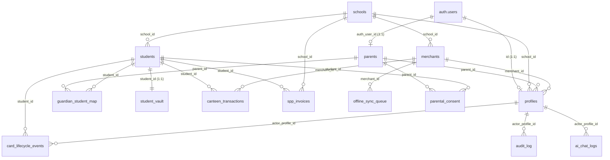

# VALO Education Ecosystem — Database Schema Documentation

> **Target Database:** PostgreSQL 15+ (Supabase)  
> **Schema Version:** 2.0  
> **DDL Export:** [`supabase/schema_dump.sql`](file:///c:/Tugas/Kerja/prototype-bni/supabase/schema_dump.sql)  
> **Source Migrations:** `supabase/migrations/001_core_schema.sql`, `002_rls_policies.sql`, `003_functions.sql`

---

## 1. Entity-Relationship (ER) Diagram

---

## 2. Table Definitions

### 2.1 `schools`
Tenant root table representing educational institutions participating in the system.

| Column | Data Type | Constraints | Default | Description |
| :--- | :--- | :--- | :--- | :--- |
| `id` | `UUID` | `PRIMARY KEY` | `gen_random_uuid()` | Unique tenant identifier |
| `name` | `VARCHAR` | `NOT NULL` | — | School official name |
| `npsn` | `VARCHAR` | `UNIQUE` | — | Nomor Pokok Sekolah Nasional |
| `bni_giro_account` | `VARCHAR` | `NOT NULL` | — | Target BNI Giro account number |
| `address` | `TEXT` | — | — | Physical address |
| `status` | `VARCHAR` | `NOT NULL`, `CHECK (status IN ('active','suspended','offboarded'))` | `'active'` | School operational status |
| `created_at` | `TIMESTAMPTZ` | `NOT NULL` | `now()` | Timestamp of creation |

---

### 2.2 `parents`
Stores guardian/parent profile details and primary BNI funding account linkages.

| Column | Data Type | Constraints | Default | Description |
| :--- | :--- | :--- | :--- | :--- |
| `id` | `UUID` | `PRIMARY KEY` | `gen_random_uuid()` | Parent record ID |
| `auth_user_id` | `UUID` | `UNIQUE`, `FK -> auth.users(id) ON DELETE SET NULL` | — | Linked Supabase Auth user ID |
| `full_name` | `VARCHAR` | `NOT NULL` | — | Full legal name |
| `phone_number` | `VARCHAR` | `NOT NULL`, `UNIQUE` | — | Mobile phone number |
| `phone_verified` | `BOOLEAN` | `NOT NULL` | `false` | Phone verification flag |
| `email` | `VARCHAR` | — | — | Email address |
| `bni_account_number` | `VARCHAR` | `NOT NULL` | — | BNI source funding account |
| `created_at` | `TIMESTAMPTZ` | `NOT NULL` | `now()` | Registration timestamp |

---

### 2.3 `profiles`
Binds Supabase authentication (`auth.users`) to application roles and tenant scope (`school_id`, `parent_id`, or `merchant_id`).

| Column | Data Type | Constraints | Default | Description |
| :--- | :--- | :--- | :--- | :--- |
| `id` | `UUID` | `PRIMARY KEY`, `FK -> auth.users(id) ON DELETE CASCADE` | — | User authentication ID |
| `role` | `VARCHAR` | `NOT NULL`, `CHECK (role IN ('parent','school_admin','merchant_staff','platform_admin'))` | — | RBAC role |
| `school_id` | `UUID` | `FK -> public.schools(id)` | — | Associated school (for admins/staff) |
| `parent_id` | `UUID` | `FK -> public.parents(id)` | — | Associated parent record |
| `merchant_id` | `UUID` | `FK -> public.merchants(id)` | — | Associated canteen merchant (for staff) |
| `created_at` | `TIMESTAMPTZ` | `NOT NULL` | `now()` | Profile creation timestamp |

---

### 2.4 `merchants`
School canteen merchants operating tap-and-pay POS terminals.

| Column | Data Type | Constraints | Default | Description |
| :--- | :--- | :--- | :--- | :--- |
| `id` | `UUID` | `PRIMARY KEY` | `gen_random_uuid()` | Merchant identifier |
| `school_id` | `UUID` | `NOT NULL`, `FK -> public.schools(id)` | — | School tenant reference |
| `name` | `VARCHAR` | `NOT NULL` | — | Stall / canteen name |
| `pic_name` | `VARCHAR` | — | — | Person in charge |
| `bni_merchant_account` | `VARCHAR` | `NOT NULL` | — | Destination BNI merchant account |
| `status` | `VARCHAR` | `NOT NULL`, `CHECK (status IN ('active','suspended'))` | `'active'` | Merchant active status |
| `created_at` | `TIMESTAMPTZ` | `NOT NULL` | `now()` | Creation timestamp |

---

### 2.5 `students`
Student records holding card credentials (hashed NFC UID), pagu limits, and emergency overdraft flags.

| Column | Data Type | Constraints | Default | Description |
| :--- | :--- | :--- | :--- | :--- |
| `id` | `UUID` | `PRIMARY KEY` | `gen_random_uuid()` | Student unique identifier |
| `full_name` | `VARCHAR` | `NOT NULL` | — | Student full name |
| `school_id` | `UUID` | `NOT NULL`, `FK -> public.schools(id)` | — | School tenant reference |
| `nfc_uid_hash` | `VARCHAR` | `NOT NULL`, `UNIQUE` | — | SHA-256 hash of NFC UID + salt |
| `nfc_uid_last4` | `VARCHAR(4)` | — | — | Masked last 4 characters for display |
| `daily_limit` | `NUMERIC(12,2)` | `NOT NULL` | `20000.00` | Max daily spending allowance (Pagu) |
| `daily_limit_used` | `NUMERIC(12,2)` | `NOT NULL` | `0.00` | Current day total spending |
| `daily_limit_reset_at` | `DATE` | `NOT NULL` | `CURRENT_DATE` | Date of next pagu reset |
| `emergency_approve` | `BOOLEAN` | `NOT NULL` | `true` | Emergency overdraft enable flag |
| `emergency_limit` | `NUMERIC(12,2)` | `NOT NULL` | `15000.00` | Max single emergency overdraft amount |
| `emergency_used_today` | `BOOLEAN` | `NOT NULL` | `false` | Emergency usage flag for current day |
| `emergency_overdraft_count_7d` | `INT` | `NOT NULL` | `0` | Overdraft frequency in past 7 days |
| `card_status` | `VARCHAR` | `NOT NULL`, `CHECK (card_status IN ('active','lost_reported','blocked','graduated','transferred_out'))` | `'active'` | NFC card lifecycle status |
| `created_at` | `TIMESTAMPTZ` | `NOT NULL` | `now()` | Registration timestamp |

---

### 2.6 `guardian_student_map`
Junction table managing many-to-many relationships between parents and students.

| Column | Data Type | Constraints | Default | Description |
| :--- | :--- | :--- | :--- | :--- |
| `id` | `UUID` | `PRIMARY KEY` | `gen_random_uuid()` | Mapping record ID |
| `parent_id` | `UUID` | `NOT NULL`, `FK -> public.parents(id) ON DELETE CASCADE` | — | Parent reference |
| `student_id` | `UUID` | `NOT NULL`, `FK -> public.students(id) ON DELETE CASCADE` | — | Student reference |
| `relationship` | `VARCHAR` | — | `'orang_tua'` | Relationship description |
| `is_primary_guardian` | `BOOLEAN` | `NOT NULL` | `true` | Primary guardian indicator |
| `created_at` | `TIMESTAMPTZ` | `NOT NULL` | `now()` | Link creation timestamp |

* **Composite Constraint:** `UNIQUE (parent_id, student_id)`

---

### 2.7 `student_vault`
Savings vault accumulating unused daily pagu allowances for student savings goals.

| Column | Data Type | Constraints | Default | Description |
| :--- | :--- | :--- | :--- | :--- |
| `id` | `UUID` | `PRIMARY KEY` | `gen_random_uuid()` | Vault record ID |
| `student_id` | `UUID` | `NOT NULL`, `UNIQUE`, `FK -> public.students(id) ON DELETE CASCADE` | — | Student owner |
| `vault_balance` | `NUMERIC(12,2)` | `NOT NULL` | `0.00` | Accumulated vault balance |
| `savings_goal_name` | `VARCHAR` | — | `'Sepatu Baru'` | Savings target label |
| `savings_goal_target` | `NUMERIC(12,2)` | — | `300000.00` | Target savings amount |
| `updated_at` | `TIMESTAMPTZ` | `NOT NULL` | `now()` | Last modification timestamp |

---

### 2.8 `canteen_transactions`
Real-time tap-and-pay transactions executed at merchant POS terminals.

| Column | Data Type | Constraints | Default | Description |
| :--- | :--- | :--- | :--- | :--- |
| `id` | `UUID` | `PRIMARY KEY` | `gen_random_uuid()` | Transaction identifier |
| `student_id` | `UUID` | `NOT NULL`, `FK -> public.students(id)` | — | Student purchaser |
| `merchant_id` | `UUID` | `NOT NULL`, `FK -> public.merchants(id)` | — | Merchant terminal |
| `amount` | `NUMERIC(12,2)` | `NOT NULL`, `CHECK (amount > 0)` | — | Transaction monetary value |
| `status` | `VARCHAR` | `NOT NULL`, `CHECK (status IN ('INITIATED','SETTLED','SETTLED_OVERDRAFT','REJECTED_OVERLIMIT','OFFLINE_QUEUED','PENDING_SYNC','REJECTED_POST_HOC','COMPLETED'))` | `'INITIATED'` | Settlement / execution state |
| `is_emergency` | `BOOLEAN` | `NOT NULL` | `false` | Emergency overdraft indicator |
| `idempotency_key` | `UUID` | `NOT NULL`, `UNIQUE` | — | Client idempotency UUID |
| `client_local_tx_uuid` | `UUID` | — | — | POS local queue tracking ID |
| `settlement_batch_id` | `UUID` | — | — | Batch ID for end-of-day settlement |
| `items` | `JSONB` | — | — | Snapshot of itemized items bought |
| `created_at` | `TIMESTAMPTZ` | `NOT NULL` | `now()` | Transaction timestamp |

---

### 2.9 `spp_invoices`
Monthly tuition/SPP billing records and BNI Host-to-Host (H2H) settlement tracking.

| Column | Data Type | Constraints | Default | Description |
| :--- | :--- | :--- | :--- | :--- |
| `id` | `UUID` | `PRIMARY KEY` | `gen_random_uuid()` | Invoice record ID |
| `student_id` | `UUID` | `NOT NULL`, `FK -> public.students(id)` | — | Billed student |
| `school_id` | `UUID` | `NOT NULL`, `FK -> public.schools(id)` | — | Billing school tenant |
| `period` | `VARCHAR` | `NOT NULL` | — | Billing period in `YYYY-MM` format |
| `amount` | `NUMERIC(12,2)` | `NOT NULL` | — | Tuition invoice amount |
| `status` | `VARCHAR` | `NOT NULL`, `CHECK (status IN ('UNPAID','PAID','FAILED','OVERDUE'))` | `'UNPAID'` | Payment status |
| `retry_count` | `INT` | `NOT NULL` | `0` | Auto-debit retry attempts count |
| `due_date` | `DATE` | `NOT NULL` | — | Invoice due date |
| `paid_at` | `TIMESTAMPTZ` | — | — | Successful payment timestamp |
| `bni_h2h_reference` | `VARCHAR` | — | — | BNI H2H transaction reference |
| `created_at` | `TIMESTAMPTZ` | `NOT NULL` | `now()` | Invoice generation timestamp |

* **Composite Constraint:** `UNIQUE (student_id, period)`

---

### 2.10 `wallet_ledger`
Internal double-entry accounting ledger tracking balance movements across all system accounts.

| Column | Data Type | Constraints | Default | Description |
| :--- | :--- | :--- | :--- | :--- |
| `id` | `UUID` | `PRIMARY KEY` | `gen_random_uuid()` | Ledger entry ID |
| `account_type` | `VARCHAR` | `NOT NULL`, `CHECK (account_type IN ('parent','student_vault','merchant','school_escrow'))` | — | Target account type |
| `account_ref_id` | `UUID` | `NOT NULL` | — | Foreign reference ID |
| `entry_type` | `VARCHAR` | `NOT NULL`, `CHECK (entry_type IN ('DEBIT','CREDIT'))` | — | Accounting direction |
| `amount` | `NUMERIC(12,2)` | `NOT NULL` | — | Transaction amount |
| `balance_after` | `NUMERIC(12,2)` | `NOT NULL` | — | Resulting balance post-entry |
| `reference_table` | `VARCHAR` | `NOT NULL` | — | Source table (e.g. `canteen_transactions`) |
| `reference_id` | `UUID` | `NOT NULL` | — | Source transaction UUID |
| `created_at` | `TIMESTAMPTZ` | `NOT NULL` | `now()` | Entry timestamp |

---

### 2.11 `idempotency_keys`
Prevents duplicate financial execution by caching API request endpoints and response payloads for 24 hours.

| Column | Data Type | Constraints | Default | Description |
| :--- | :--- | :--- | :--- | :--- |
| `id` | `UUID` | `PRIMARY KEY` | `gen_random_uuid()` | Idempotency record ID |
| `key` | `UUID` | `NOT NULL`, `UNIQUE` | — | Client request UUID |
| `endpoint` | `VARCHAR` | `NOT NULL` | — | Target API route |
| `response_snapshot` | `JSONB` | — | — | Cached response JSON |
| `status` | `VARCHAR` | `NOT NULL`, `CHECK (status IN ('PROCESSING','COMPLETED','FAILED'))` | `'PROCESSING'` | Execution state |
| `created_at` | `TIMESTAMPTZ` | `NOT NULL` | `now()` | Initial request timestamp |
| `expires_at` | `TIMESTAMPTZ` | `NOT NULL` | `now() + 24 hours` | Expiration timestamp |

---

### 2.12 `offline_sync_queue`
Audit queue tracking POS transactions performed while offline and pending cloud synchronization.

| Column | Data Type | Constraints | Default | Description |
| :--- | :--- | :--- | :--- | :--- |
| `id` | `UUID` | `PRIMARY KEY` | `gen_random_uuid()` | Sync record ID |
| `merchant_id` | `UUID` | `NOT NULL`, `FK -> public.merchants(id)` | — | Originating POS merchant |
| `local_tx_uuid` | `UUID` | `NOT NULL`, `UNIQUE` | — | POS local transaction ID |
| `payload` | `JSONB` | `NOT NULL` | — | Full transaction payload |
| `sync_status` | `VARCHAR` | `NOT NULL`, `CHECK (sync_status IN ('PENDING','SYNCED','CONFLICT','DISCARDED'))` | `'PENDING'` | Sync processing status |
| `created_at` | `TIMESTAMPTZ` | `NOT NULL` | `now()` | Local queue creation time |
| `synced_at` | `TIMESTAMPTZ` | — | — | Server sync completion time |

---

### 2.13 `card_lifecycle_events`
Audit trail recording all card management events (issuance, loss, blocking, replacement).

| Column | Data Type | Constraints | Default | Description |
| :--- | :--- | :--- | :--- | :--- |
| `id` | `UUID` | `PRIMARY KEY` | `gen_random_uuid()` | Event ID |
| `student_id` | `UUID` | `NOT NULL`, `FK -> public.students(id)` | — | Target student |
| `event_type` | `VARCHAR` | `NOT NULL`, `CHECK (event_type IN ('issued','lost_reported','blocked','reissued','offboarded'))` | — | Event classification |
| `notes` | `TEXT` | — | — | Additional operational context |
| `actor_profile_id` | `UUID` | `FK -> public.profiles(id)` | — | Profile ID of user performing action |
| `created_at` | `TIMESTAMPTZ` | `NOT NULL` | `now()` | Event timestamp |

---

### 2.14 `parental_consent`
Compliance storage for minor data processing consents under UU PDP (Indonesian Personal Data Protection Law).

| Column | Data Type | Constraints | Default | Description |
| :--- | :--- | :--- | :--- | :--- |
| `id` | `UUID` | `PRIMARY KEY` | `gen_random_uuid()` | Consent record ID |
| `parent_id` | `UUID` | `NOT NULL`, `FK -> public.parents(id)` | — | Consenting parent |
| `student_id` | `UUID` | `NOT NULL`, `FK -> public.students(id)` | — | Minor student subject |
| `consent_type` | `VARCHAR` | `NOT NULL` | `'DATA_PROCESSING_MINOR'` | Legal consent type |
| `consent_token` | `VARCHAR` | `NOT NULL` | — | Verification cryptographic token |
| `granted_at` | `TIMESTAMPTZ` | — | — | Timestamp consent granted |
| `revoked_at` | `TIMESTAMPTZ` | — | — | Timestamp consent revoked |
| `created_at` | `TIMESTAMPTZ` | `NOT NULL` | `now()` | Creation timestamp |

---

### 2.15 `audit_log`
Immutable system audit log for security forensics, regulatory compliance, and anomaly tracking.

| Column | Data Type | Constraints | Default | Description |
| :--- | :--- | :--- | :--- | :--- |
| `id` | `UUID` | `PRIMARY KEY` | `gen_random_uuid()` | Audit log entry ID |
| `actor_profile_id` | `UUID` | `FK -> public.profiles(id)` | — | User executing action |
| `action` | `VARCHAR` | `NOT NULL` | — | Action descriptor |
| `entity_type` | `VARCHAR` | `NOT NULL` | — | Target entity domain |
| `entity_id` | `UUID` | — | — | Affected record UUID |
| `metadata` | `JSONB` | — | — | Contextual metadata payload |
| `flag` | `VARCHAR` | — | — | Special flag (e.g. `FREQUENT_OVERDRAFT`) |
| `ip_address` | `INET` | — | — | Originating IP address |
| `created_at` | `TIMESTAMPTZ` | `NOT NULL` | `now()` | Audit record timestamp |

---

### 2.16 `ai_chat_logs`
Audit log recording interaction prompts, AI output responses, and tool calls across AI personas.

| Column | Data Type | Constraints | Default | Description |
| :--- | :--- | :--- | :--- | :--- |
| `id` | `UUID` | `PRIMARY KEY` | `gen_random_uuid()` | Log ID |
| `persona_type` | `VARCHAR` | `NOT NULL`, `CHECK (persona_type IN ('merchant_ai','school_treasury_ai','parent_ai'))` | — | AI persona variant |
| `actor_profile_id` | `UUID` | `FK -> public.profiles(id)` | — | Prompting user profile |
| `prompt` | `TEXT` | `NOT NULL` | — | Input prompt text |
| `response` | `TEXT` | `NOT NULL` | — | AI response text |
| `function_calls` | `JSONB` | — | — | Tool/function call telemetry |
| `created_at` | `TIMESTAMPTZ` | `NOT NULL` | `now()` | Chat timestamp |

---

## 3. Database Indexes

| Index Name | Target Table | Indexed Columns | Purpose |
| :--- | :--- | :--- | :--- |
| `idx_students_school` | `students` | `(school_id)` | Accelerates tenant-scoped student queries |
| `idx_gsm_student` | `guardian_student_map` | `(student_id)` | Fast lookup of guardians for a student |
| `idx_gsm_parent` | `guardian_student_map` | `(parent_id)` | Fast lookup of students under a parent |
| `idx_ctx_student` | `canteen_transactions` | `(student_id)` | Optimizes student transaction history |
| `idx_ctx_merchant` | `canteen_transactions` | `(merchant_id, created_at)` | Accelerates merchant daily sales reports |
| `idx_ctx_batch` | `canteen_transactions` | `(settlement_batch_id)` | Batch settlement retrieval |
| `idx_spp_school_period` | `spp_invoices` | `(school_id, period)` | Tenant monthly tuition reconciliation |
| `idx_ledger_account` | `wallet_ledger` | `(account_type, account_ref_id)` | Internal ledger balance lookup |

---

## 4. Row Level Security (RLS) Policies

All tables enforce Row Level Security. Core helper functions (`current_profile()`, `current_role()`, `current_school_id()`, `current_parent_id()`, `current_merchant_id()`, `is_platform_admin()`) execute as `SECURITY DEFINER` to securely inspect session state (`auth.uid()`).

| Table | Policy Name | Command | Policy Definition / Scope |
| :--- | :--- | :--- | :--- |
| `profiles` | `profiles_self_select` | `SELECT` | User can only read their own profile, or `platform_admin` read-all |
| `schools` | `schools_admin_select` | `SELECT` | Scoped to user's school ID or `platform_admin` |
| `students` | `students_school_admin_select` | `SELECT` | School admins read students in their school |
| `students` | `students_parent_select` | `SELECT` | Parents read mapped children via `guardian_student_map` |
| `students` | `students_merchant_select` | `SELECT` | Merchants lookup student in their school during POS scan |
| `students` | `students_platform_admin_all` | `ALL` | Full access for platform admins |
| `student_vault` | `vault_parent_select` | `SELECT` | Parents view vault of mapped children |
| `student_vault` | `vault_parent_update_goal` | `UPDATE` | Parents update savings goals for mapped children |
| `canteen_transactions` | `ctx_merchant_own` | `SELECT` | Merchants view own sales |
| `canteen_transactions` | `ctx_merchant_insert` | `INSERT` | Merchants record sales for own merchant ID |
| `canteen_transactions` | `ctx_parent_select` | `SELECT` | Parents view purchases made by their children |
| `canteen_transactions` | `ctx_school_admin_select` | `SELECT` | School admins view all canteen purchases in school |
| `spp_invoices` | `spp_parent_select` | `SELECT` | Parents view tuition invoices for their children |
| `spp_invoices` | `spp_school_admin_all` | `SELECT` | School admins view all invoices in school |
| `wallet_ledger` | `ledger_platform_admin_only` | `SELECT` | Restricted to `platform_admin`; financial updates via `service_role` |
| `offline_sync_queue` | `osq_merchant_own` | `ALL` | Merchants manage own offline sync entries |
| `card_lifecycle_events`| `card_events_parent_select` | `SELECT` | Parents view card events for their children |
| `card_lifecycle_events`| `card_events_school_admin_select` | `SELECT` | School admins view card events in school |
| `parental_consent` | `consent_parent_own` | `ALL` | Parents read/manage consent for their children |
| `audit_log` | `audit_platform_admin_select` | `SELECT` | Platform admin full audit log access |
| `audit_log` | `audit_school_admin_scoped` | `SELECT` | School admin read audit logs matching `school_id` |
| `ai_chat_logs` | `ai_logs_own_persona` | `SELECT` | Users read own prompt history or `platform_admin` |
| `guardian_student_map` | `gsm_parent_select` | `SELECT` | Parents view own student mappings |
| `guardian_student_map` | `gsm_school_admin_select` | `SELECT` | School admins view student mappings in school |
| `parents` | `parents_self_select` | `SELECT` | Parents view own parent profile |
| `parents` | `parents_self_update` | `UPDATE` | Parents update own parent profile |
| `merchants` | `merchants_staff_select` | `SELECT` | Staff view own merchant or school merchants |

---

## 5. Stored Procedures & Scheduled Jobs (`pg_cron`)

### 5.1 `sp_rollover_daily_vault()`
* **Execution:** Scheduled via `pg_cron` daily at **23:59 WIB** (`59 16 * * *` UTC).
* **Logic:** 
  1. Calculates unused daily pagu (`daily_limit - daily_limit_used`) for students resetting today.
  2. Adds unused remainder atomically to `student_vault.vault_balance`.
  3. Resets `daily_limit_used = 0`, `emergency_used_today = false`, and advances `daily_limit_reset_at = CURRENT_DATE + 1`.
  4. Writes event telemetry into `audit_log`.

### 5.2 `sp_flag_frequent_overdraft()`
* **Execution:** Scheduled via `pg_cron` weekly on **Mondays at 07:00 WIB** (`0 0 * * 1` UTC).
* **Logic:**
  1. Scans `canteen_transactions` over past 7 days for students with `> 2` emergency overdraft settlements (`is_emergency = true`).
  2. Updates `students.emergency_overdraft_count_7d`.
  3. Writes audit flag (`FREQUENT_OVERDRAFT`) into `audit_log`.

### 5.3 `sp_cleanup_expired_idempotency_keys()`
* **Execution:** Scheduled via `pg_cron` daily at **02:00 UTC** (`0 2 * * *` UTC).
* **Logic:**
  1. Deletes records from `idempotency_keys` where `expires_at < now()`.
