# DOKUMEN SPESIFIKASI PRODUK & ARSITEKTUR TEKNIS MVP
## VALO Education Ecosystem: Closed-Loop Institutional Banking
### Master Product Requirement Document (PRD) & Technical Architecture Specification — **v2.0 (Enterprise-Grade Refactor)**

| | |
|---|---|
| **Program** | BNI Spark Arc 2026 (BNV Arcade) |
| **Penyusun Asli** | Tim VALO (Abyan Arif Izzat Satrio, dkk.) |
| **Direfaktor oleh** | Elite FinTech CTO Review Board (AI-Assisted Architecture Audit) |
| **Status Dokumen** | Master Functional & Technical Specification — **MVP Phase 1 + Gap-Hardened** |
| **Versi** | v2.0 — Supersedes v1.0 (Google Docs Print-to-PDF, 10 halaman) |
| **Tujuan** | Panduan eksekusi koding, audit kepatuhan, dan cetak biru integrasi ke wondr by BNI (Fase 2) |
| **Klasifikasi** | Internal — Confidential (mengandung skema data pribadi anak & alur keuangan) |

---

## DAFTAR ISI

0. [Ringkasan Peningkatan Arsitektur & Gap yang Dilengkapi](#0-ringkasan-peningkatan-arsitektur--gap-yang-dilengkapi)
1. [Executive Summary & Visi Monopoli Transaksi](#1-executive-summary--visi-monopoli-transaksi)
2. [Resolusi Keputusan Fitur & Best Practices](#2-resolusi-keputusan-fitur--best-practices)
3. [Arsitektur Multi-App & Perancangan UI/UX](#3-arsitektur-multi-app--perancangan-uiux)
4. [User Personas & Comprehensive User Journey](#4-user-personas--comprehensive-user-journey)
5. [System Diagrams (Use Case, State Machine, Sequence, Flowchart)](#5-system-diagrams)
6. [Data Architecture — Skema Database & Row Level Security (Supabase)](#6-data-architecture)
7. [Transaction Integrity — Idempotency & Concurrency Control](#7-transaction-integrity)
8. [Offline-First Resilience untuk Merchant POS](#8-offline-first-resilience)
9. [Spesifikasi RESTful API & Kontrak Data](#9-spesifikasi-restful-api)
10. [Arsitektur AI Chatbot — System Prompt & Function Calling Schema](#10-arsitektur-ai-chatbot)
11. [Compliance, Risk & Security Framework](#11-compliance-risk--security)
12. [Edge Case & Anomaly Handling](#12-edge-case--anomaly-handling)
13. [Unit Economics & Value Proposition](#13-unit-economics--value-proposition)
14. [Tech Stack, Observability & Roadmap Integrasi wondr by BNI](#14-tech-stack-observability--roadmap)
15. [Appendix: Glosarium & Referensi Regulasi](#15-appendix)

---

## 0. RINGKASAN PENINGKATAN ARSITEKTUR & GAP YANG DILENGKAPI

Audit terhadap dokumen input (v1.0, 10 halaman) menemukan bahwa dokumen tersebut **kuat secara konsep produk dan UX**, namun **belum production-ready** dari sisi rekayasa perangkat lunak enterprise, keamanan data, dan kepatuhan regulasi perbankan Indonesia. Berikut adalah 17 gap kritis yang teridentifikasi dan telah dilengkapi pada dokumen v2.0 ini:

| No | Kategori | Gap yang Ditemukan di v1.0 | Solusi yang Ditambahkan di v2.0 |
|---|---|---|---|
| 1 | **Security** | Tidak ada Row Level Security (RLS) sama sekali di schema Supabase — 1 database terpusat tanpa isolasi antar sekolah/orang tua | Skema RLS lengkap multi-tenant berbasis `profiles` + helper function `SECURITY DEFINER` (§6.3) |
| 2 | **Data Model** | Hanya 3 tabel (`students`, `student_vault`, `canteen_transactions`); tidak ada `schools`, `parents`, `merchants`, `spp_invoices`, ledger, audit log | 16 tabel inti + entity relationship lengkap (§6.1–6.2) |
| 3 | **Integrity** | Tidak ada mekanisme anti double-swipe/double-tap NFC | Idempotency-Key pattern + `SELECT ... FOR UPDATE` pessimistic locking (§7) |
| 4 | **Resilience** | Tidak ada strategi saat internet kantin mati (padahal POS bergantung penuh pada real-time DB) | Offline-first queueing (IndexedDB) + sync & conflict resolution protocol (§8) |
| 5 | **Contract** | Tidak ada API contract terformalisasi (hanya deskripsi naratif) | Tabel spesifikasi REST API lengkap: method, payload, response, error code, auth scheme (§9) |
| 6 | **AI Governance** | Chatbot hanya diberi "contoh output", tanpa system prompt & function calling schema nyata | System prompt + JSON function calling schema untuk 3 persona AI (§10) |
| 7 | **Compliance** | Tidak ada pembahasan UU PDP untuk data anak <17 tahun (NFC UID adalah data pribadi spesifik anak) | Kerangka kepatuhan UU PDP, parental consent token, data minimization (§11.1) |
| 8 | **Security Standard** | Tidak ada tokenization NFC UID; UID mentah tersimpan sebagai VARCHAR biasa | Skema tokenization & hashing UID, referensi PCI-DSS/ISO 27001 (§11.2) |
| 9 | **Edge Case** | Tidak ada penanganan kartu hilang/dicuri/rusak | State `card_lifecycle_events` + SOP blokir & reissue (§12.1) |
| 10 | **Edge Case** | Tidak ada penanganan ganti nomor HP orang tua & token sesi hangus | Alur re-verifikasi OTP & rotasi token (§12.2) |
| 11 | **Reliability** | Tidak ada penanganan *pagu timeout* saat H2H BNI lambat/down | Circuit breaker + fallback offline-approval bersyarat (§12.3) |
| 12 | **Lifecycle** | Tidak ada alur offboarding siswa pindah/lulus & pencairan vault | SOP offboarding + rekonsiliasi saldo vault (§12.4) |
| 13 | **Anti-Fraud** | Emergency Auto-Approval tidak punya rate limiting — berisiko disalahgunakan berulang kali dalam sehari | Rule tambahan: maksimal 1x/hari, anomaly flag jika berulang >2x/minggu (§2.4, §12.5) |
| 14 | **Diagram** | Diagram hanya ASCII-art sederhana tanpa notasi status/transisi formal | State Machine Diagram (Mermaid `stateDiagram-v2`) untuk status transaksi (§5.2) |
| 15 | **Diagram** | Tidak ada sequence diagram teknis untuk flow kritis | 2 Sequence Diagram Mermaid detail: NFC Tap & SPP Auto-Debit (§5.3–5.4) |
| 16 | **Finance** | Angka unit economics (CAC Rp27.000, efisiensi Rp3,42M) disebut tanpa breakdown perhitungan | Formula & asumsi perhitungan lengkap (§13) |
| 17 | **Ops** | Tidak ada data retention policy, backup/DR (RTO/RPO), maupun observability/audit trail | Kebijakan retensi data + strategi observability (§11.4, §14.2) |

> **Catatan Metodologi:** Seluruh penambahan di atas mengacu pada best practice industri: OWASP ASVS, Supabase RLS Guide, POJK No. 12/2024 (Penyelenggaraan Sistem Pembayaran), SNAP BI (Standar Nasional Open API Pembayaran), UU No. 27/2022 tentang Pelindungan Data Pribadi, serta PCI-DSS v4.0 principles untuk tokenization data sensitif.

---

## 1. EXECUTIVE SUMMARY & VISI MONOPOLI TRANSAKSI

### 1.1 Tesis Utama Proyek

**VALO Education Ecosystem** adalah sistem perbankan institusional tertutup (*Closed-Loop Ecosystem*) yang mengonsolidasikan seluruh transaksi keuangan di lingkungan institusi pendidikan (sekolah K-12 dan kampus) ke dalam satu rel pembayaran yang terikat dengan BNI.

Dengan menjadikan **Kartu Tanda Pelajar (KTP) ber-NFC** sebagai identitas sekaligus alat pembayaran resmi, VALO mengunci seluruh arus dana — mulai dari SPP/UKT, iuran kegiatan, hingga jajan harian kantin — ke dalam ekosistem BNI, sekaligus menghasilkan data transaksi terstruktur yang bernilai tinggi untuk *credit scoring* masa depan (opsional, Fase 3) dan cross-sell produk BNI (Giro sekolah, Deposito, Reksa Dana, wondr Growth).

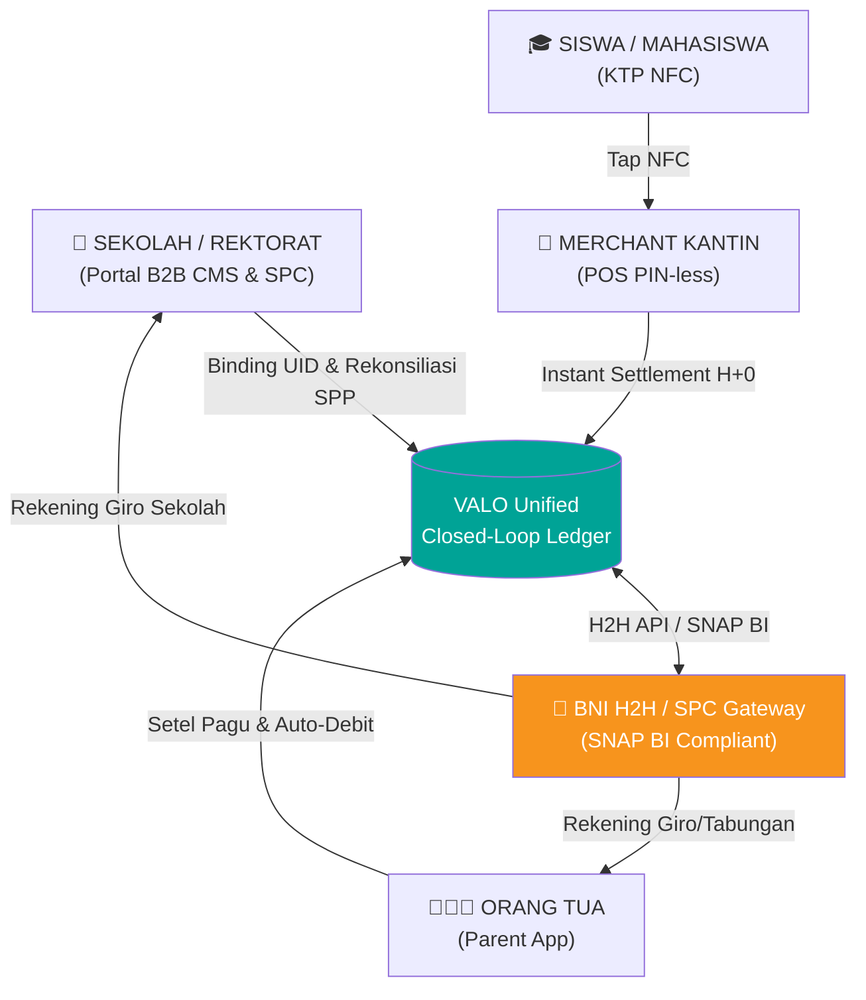

### 1.2 Pilar Utama MVP

1. **Identitas Tunggal berbasis NFC Card UID:** Setiap siswa mendapatkan KTP NFC dengan *Unique Identifier* (UID) yang **di-tokenisasi** (lihat §11.2) saat pertama masuk sekolah.
2. **Satu Sistem, Tiga Antarmuka (3 Unified UIs):** Aplikasi terpisah untuk Orang Tua, Kasir Kantin, dan Sekolah, terhubung pada satu database terpusat dengan isolasi RLS multi-tenant.
3. **Monopoli Transaksi Terbuka & Tertutup:** Seluruh pembayaran SPP, iuran, jajan kantin, dan kas organisasi wajib melalui sistem VALO — dengan *graceful degradation* saat offline (§8) agar monopoli tidak berarti *single point of failure*.

> **v2.0 Enhancement:** Tesis "monopoli transaksi" di v1.0 secara implisit mengasumsikan konektivitas 100%. Di v2.0, kami eksplisit menambahkan bahwa monopoli ini harus **resilient by design** — kegagalan jaringan tidak boleh menghentikan siswa membeli makanan (§8, §12.3).

---

## 2. RESOLUSI KEPUTUSAN FITUR & BEST PRACTICES

Berdasarkan analisis kebutuhan dan standar industri perbankan/fintech, berikut resolusi keputusan untuk area krusial (dipertahankan dari v1.0, diperkaya dengan *hardening* v2.0):

### 2.1 Alokasi Sisa Pagu Jajan (Student Goal Vault)

- **Keputusan:** *Student Goal Vault* (Tabungan Impian Siswa) dengan **Parent Approval Control** (Dual Control).
- **Mekanisme:**
  - Sisa pagu harian yang tidak terpakai pada pukul 23:59 **tidak** ditambahkan ke pagu harian esok hari (mencegah anak menumpuk pagu untuk belanja impulsif besar).
  - Sisa pagu otomatis dialokasikan ke **Vault/Kantong Tabungan Siswa** di dalam aplikasi.
  - Tabungan adalah hak penuh siswa, namun pencairan memerlukan persetujuan orang tua (*Dual Control*) untuk membeli barang impian atau dicairkan kembali ke rekening utama orang tua.
- **Alasan Best Practice:** Mendidik anak tentang *delayed gratification* tanpa mengorbankan kontrol likuiditas keluarga.
- **v2.0 — Gap Ditambahkan:** Proses roll-over 23:59 harus **atomic & idempotent** (dieksekusi via scheduled Postgres function/`pg_cron`, bukan cron eksternal yang bisa retry ganda) — lihat `sp_rollover_daily_vault()` di §7.3.

### 2.2 AI Chatbot Analytics Contextual per User Persona

AI Chatbot dirancang kontekstual dan memberi manfaat langsung sesuai peran masing-masing *user* (detail system prompt & function calling schema lihat **§10**):

| Persona | Fokus AI | Contoh Output |
|---|---|---|
| **A. Kantin Merchant AI** | Sales & Inventory Management | *"Hari ini omzetmu Rp450.000. Stok Nasi Goreng sisa 3 porsi. Rekomendasi: tambah porsi besok."* |
| **B. School Admin B2B AI** | Financial Treasury & Cashflow Optimization | *"92% SPP bulan ini lunas. Ada dana mengendap Rp1,2 Miliar di Giro BNI. Rekomendasi: alokasikan Rp400 Juta ke BNI Deposito."* |
| **C. Parent App AI** | Family Budgeting & Child Nutrition Advisory | *"Anak Anda minggu ini 65% jajan di kategori gorengan/es. Sisa Tabungan Vault Rp180.000, disarankan dialokasikan ke wondr Reksa Dana."* |

### 2.3 Simulasi Tap NFC Kasir Kantin

- **Keputusan UI/UX:** *Disguised Interactive NFC Trigger* (Seamless Bottom Sheet), bukan `<select>` dropdown bawaan OS.
- **Mekanisme:** Kartu interaktif animasi gelombang NFC bertuliskan "Tempelkan Kartu KTP NFC Siswa…" → saat ditap, membuka *Bottom Sheet* berisi daftar simulator UID siswa untuk keperluan demo/testing.
- **v2.0 — Catatan Produksi:** Komponen simulator ini **wajib** dinonaktifkan (feature-flagged `NEXT_PUBLIC_NFC_SIMULATOR_ENABLED=false`) di environment produksi dan hanya aktif di staging/demo, karena secara langsung meng-*expose* daftar UID siswa nyata jika salah konfigurasi — ini adalah risiko kebocoran data anak (lihat §11.1).

### 2.4 Emergency Auto-Approval Toggle

- **Keputusan:** *Active with Overdraft Guard & 30-Second Timeout Buffer*.
- **Alasan Best Practice:**
  1. **Mencegah Antrean Kasir Kantin:** Jam istirahat sekolah sangat singkat (15–20 menit); pagu habis akan memacetkan antrean.
  2. **Pengamanan Terukur (Overdraft Cap):** Batas kelonggaran darurat maksimal **Rp15.000**, hanya berlaku untuk kategori makanan kantin (tidak berlaku untuk barang terlarang).
  3. **Notifikasi Pasca-Kejadian:** Orang tua langsung menerima notifikasi WhatsApp setelah *Auto-Approve* aktif, lengkap dengan alasan.
- **v2.0 — Gap Ditambahkan (Anti-Fraud):**
  - **Rate limit:** maksimal **1x overdraft per hari** per siswa; percobaan kedua di hari yang sama otomatis `REJECTED_OVERLIMIT` walau toggle aktif.
  - **Anomaly flag:** jika overdraft terjadi **>2x dalam 7 hari berjalan**, sistem membuat entri di `audit_log` dengan `flag='FREQUENT_OVERDRAFT'` dan mengirim ringkasan mingguan ke orang tua agar pagu harian dapat direvisi — mencegah *emergency mode* menjadi jalur belanja rutin yang menyamarkan kontrol pagu.
  - Overdraft ditagihkan sebagai **piutang talangan (advance)** yang otomatis dipotong dari pengisian pagu berikutnya, bukan utang tak berbunga tanpa batas waktu.

---

## 3. ARSITEKTUR MULTI-APP & PERANCANGAN UI/UX

Sistem VALO terdiri dari **3 Aplikasi Terpisah** yang terhubung dalam satu *Unified Database*, ditambah 1 lapisan backend bersama:

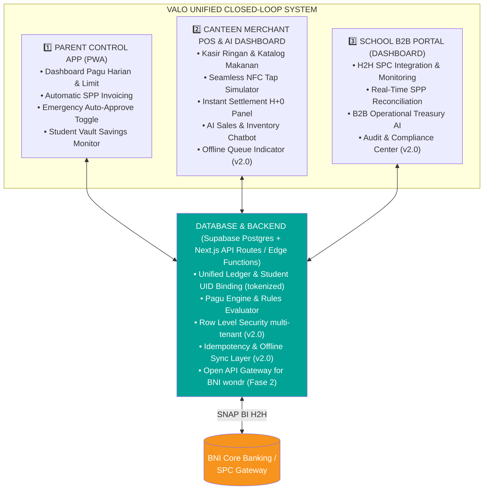

**v2.0 — Penambahan Arsitektural:**
- **Edge Functions (Supabase/Vercel)** dipisahkan menjadi 3 domain layanan: `pagu-evaluator`, `settlement-worker`, `notification-dispatcher` — agar beban tinggi di satu domain (mis. jam istirahat sekolah) tidak menurunkan performa domain lain.
- **API Gateway Layer** ditambahkan di depan seluruh endpoint publik untuk *rate limiting*, *request signing verification* (H2H), dan *WAF* dasar — lihat §9.3.

---

## 4. USER PERSONAS & COMPREHENSIVE USER JOURNEY

### 4.1 Detail Persona

**Persona 1: Bu Dewi (42 th) — Orang Tua Murid K-12**
- **Kebutuhan:** Mengontrol uang saku anak, memastikan SPP terbayar tepat waktu, mengetahui anak makan dengan baik.
- **Pain Point:** Khawatir uang saku salah guna, repot konfirmasi transfer SPP manual.

**Persona 2: Pak Yusuf (45 th) — Pengelola Kantin Sehat**
- **Kebutuhan:** Transaksi cepat tanpa repot kembalian, uang hasil jualan cair hari itu juga untuk belanja bahan besok.
- **Pain Point:** Antrean kasir panjang saat istirahat, pencairan e-wallet konvensional lambat (H+1/H+2).

**Persona 3: Pak Budi (50 th) — Bendahara Sekolah SMAN 1**
- **Kebutuhan:** Rekonsiliasi SPP otomatis, kepastian kas operasional sekolah, transparansi laporan.
- **Pain Point:** Menghabiskan 40 jam per bulan mengecek mutasi transfer manual satu per satu.

**Persona 4: Akbar (16 th) — Siswa SMAN 1 Surabaya** *(v2.0 — persona baru, sebelumnya hanya disebut sebagai aktor tanpa detail kebutuhan)*
- **Kebutuhan:** Jajan cepat tanpa antre lama, punya kendali kecil atas keputusan belanja sendiri, bisa menabung untuk barang impian.
- **Pain Point:** Malu jika ditolak transaksi di depan teman saat pagu habis; tidak punya rekening bank sendiri (di bawah umur) sehingga seluruh kendali finansial ada di tangan orang tua — perlu keseimbangan antara otonomi dan pengawasan.
- **Implikasi Desain:** Emergency Auto-Approval (§2.4) dan UX yang tidak mempermalukan anak di depan umum saat transaksi ditolak (pesan netral di layar POS, notifikasi detail hanya ke orang tua).

### 4.2 Integrated Lifecycle Journey

**[ STAGE 1: ONBOARDING SEKOLAH ]**
1. Sekolah mendaftarkan siswa baru di School B2B Portal.
2. Kartu Pelajar Digital Co-Brand BNI (KTP NFC) diterbitkan & UID di-*binding* ke akun siswa (UID langsung ditokenisasi saat binding — §11.2).
3. Orang tua menerima WhatsApp Link untuk aktivasi Parent App & link rekening BNI.
4. **(v2.0 — Ditambahkan)** Orang tua wajib menyetujui **Parental Consent Token** untuk pemrosesan data anak (nama, UID kartu, riwayat transaksi, data nutrisi) sesuai UU PDP sebelum akun siswa aktif — lihat §11.1.

**[ STAGE 2: RUTINITAS BULANAN (SPP Auto-Debit) ]**
1. Tanggal 1 tiap bulan, sistem BNI memotong SPP otomatis dari rekening orang tua.
2. School B2B Portal mencatat status "LUNAS" secara real-time.
3. Waktu kerja rekapitulasi bendahara berkurang dari 40 jam menjadi 2 jam/bulan.
4. **(v2.0)** Jika saldo tidak cukup: invoice berstatus `FAILED`, retry otomatis H+1 dan H+3, notifikasi eskalasi ke orang tua & bendahara pada percobaan ketiga (lihat state machine §5.2 dan endpoint `POST /v1/spp/retry` §9).

**[ STAGE 3: RUTINITAS HARIAN (Transaksi Kantin) ]**
1. Orang tua menyetel Pagu Harian Rp20.000 via Parent App.
2. Siswa memilih menu di kantin seharga Rp12.000.
3. Siswa menempelkan (tap) KTP NFC di POS Kantin.
4. Pagu harian terpotong Rp12.000. Sisa Pagu = Rp8.000.
5. Merchant Kantin menerima notifikasi & pencairan H+0 di sore hari (via settlement batch, bukan real-time per transaksi — lihat §7.2 untuk alasan teknis).

**[ STAGE 4: END-OF-DAY SAVINGS ROLL-OVER ]**
1. Pukul 23:59 WIB, sisa pagu Rp8.000 otomatis dipindahkan ke Student Goal Vault via `sp_rollover_daily_vault()` (job terjadwal, idempoten — §7.3).
2. Siswa dapat memantau akumulasi tabungannya untuk membeli barang impian.

**[ STAGE 5 (v2.0 — Baru): EXCEPTION JOURNEYS ]**

| Skenario | Trigger | Alur Singkat | Detail |
|---|---|---|---|
| Kartu hilang/dicuri | Orang tua lapor via app | Blokir instan → kartu status `LOST` → transaksi baru otomatis `REJECTED_CARD_BLOCKED` → reissue kartu fisik H+2 | §12.1 |
| Ganti nomor HP orang tua | Orang tua ubah profil / lapor CS | Verifikasi identitas ganda → OTP ke nomor baru → semua sesi aktif direvoke | §12.2 |
| Pagu timeout (H2H BNI lambat) | Response time > 3 detik | Circuit breaker → fallback limited offline-approval → rekonsiliasi otomatis saat online kembali | §12.3 |
| Siswa pindah/lulus | Sekolah proses offboarding | Kartu dinonaktifkan → saldo vault dicairkan ke rekening orang tua → data diarsipkan sesuai retensi | §12.4 |

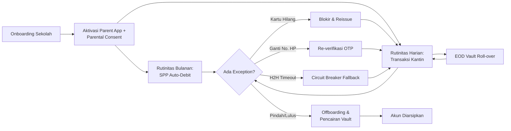

---

## 5. SYSTEM DIAGRAMS

### 5.1 Use Case Diagram

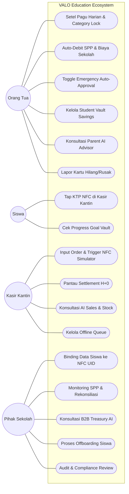

### 5.2 State Machine Diagram — Status Transaksi Kantin *(v2.0 — Baru)*

Diagram ini secara eksplisit mendefinisikan seluruh state yang mungkin dialami satu transaksi kantin, termasuk *edge case* offline dan overdraft yang tidak diformalkan di v1.0.

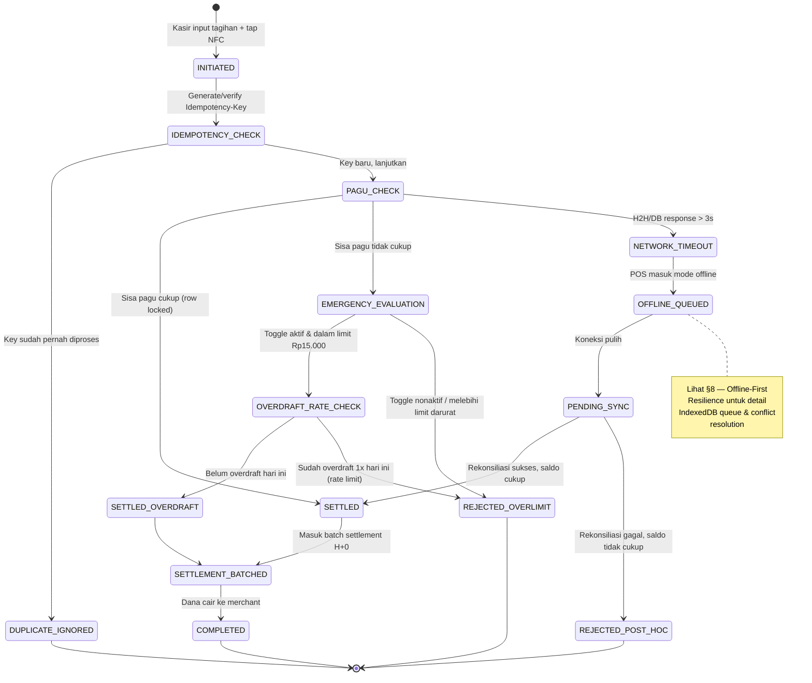

### 5.3 Sequence Diagram — Real-time NFC Tap Canteen Transaction Flow *(v2.0 — Baru)*

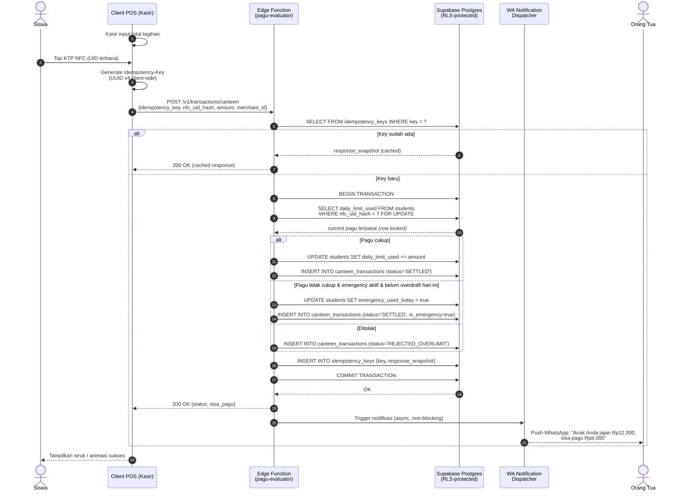

### 5.4 Sequence Diagram — Monthly SPP Auto-Debit & Reconciliation Flow *(v2.0 — Baru)*

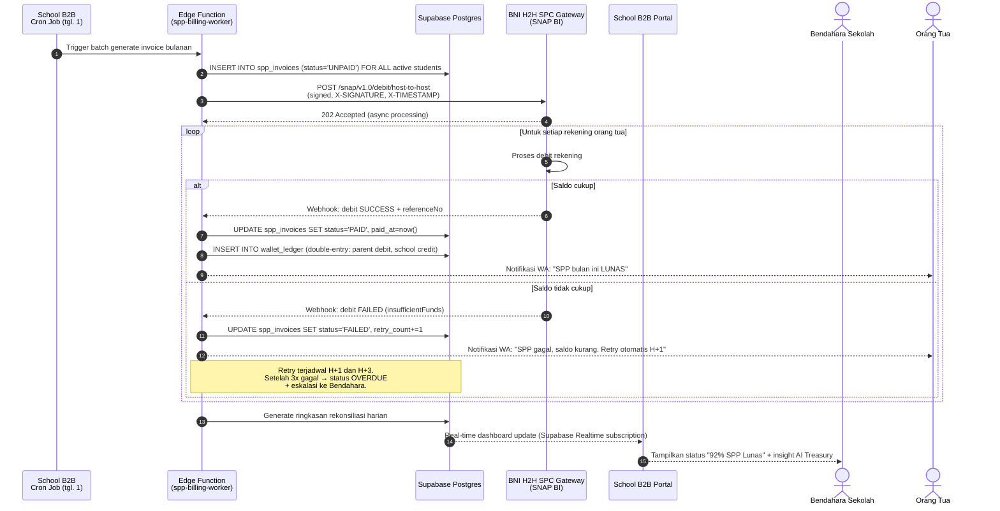

### 5.5 Flowchart — Pagu Rules Engine *(v2.0 — Diperkaya: idempotency + offline branch)*

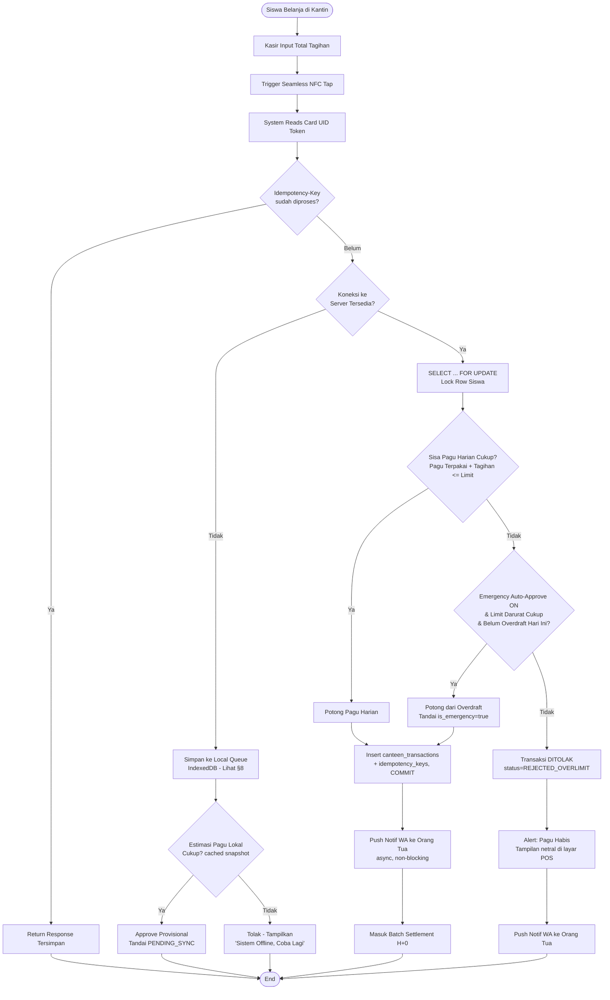

---

## 6. DATA ARCHITECTURE

### 6.1 Entity Relationship Overview

v1.0 hanya mendefinisikan 3 tabel (`students`, `student_vault`, `canteen_transactions`) tanpa entitas `schools`, `parents`, atau `merchants` — sehingga secara struktural **tidak mungkin** mengimplementasikan multi-tenant isolation. v2.0 melengkapi model data menjadi 16 tabel inti:

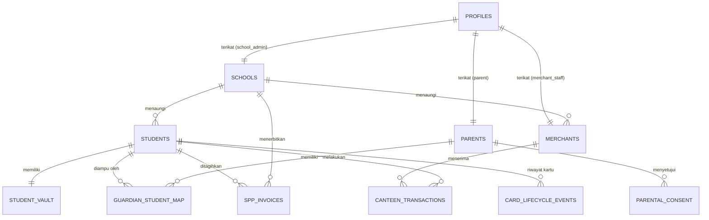

### 6.2 Skrip DDL Lengkap (Supabase / PostgreSQL 15+)

```sql
-- =============================================================
-- VALO EDUCATION ECOSYSTEM — CORE SCHEMA v2.0
-- Target: Supabase PostgreSQL 15+
-- =============================================================

create extension if not exists pgcrypto;
create extension if not exists "uuid-ossp";

-- -------------------------------------------------------------
-- 1. SCHOOLS (tenant root)
-- -------------------------------------------------------------
create table public.schools (
  id uuid primary key default gen_random_uuid(),
  name varchar not null,
  npsn varchar unique,                          -- Nomor Pokok Sekolah Nasional
  bni_giro_account varchar not null,
  address text,
  status varchar not null default 'active' check (status in ('active','suspended','offboarded')),
  created_at timestamptz not null default now()
);

-- -------------------------------------------------------------
-- 2. PARENTS
-- -------------------------------------------------------------
create table public.parents (
  id uuid primary key default gen_random_uuid(),
  auth_user_id uuid unique references auth.users(id) on delete set null,
  full_name varchar not null,
  phone_number varchar not null unique,
  phone_verified boolean not null default false,
  email varchar,
  bni_account_number varchar not null,
  created_at timestamptz not null default now()
);

-- -------------------------------------------------------------
-- 3. PROFILES (auth.users <-> role & tenant binding)
-- -------------------------------------------------------------
create table public.profiles (
  id uuid primary key references auth.users(id) on delete cascade,
  role varchar not null check (role in ('parent','school_admin','merchant_staff','platform_admin')),
  school_id uuid references public.schools(id),
  parent_id uuid references public.parents(id),
  merchant_id uuid,                             -- FK ditambahkan setelah tabel merchants dibuat
  created_at timestamptz not null default now()
);

-- -------------------------------------------------------------
-- 4. MERCHANTS
-- -------------------------------------------------------------
create table public.merchants (
  id uuid primary key default gen_random_uuid(),
  school_id uuid not null references public.schools(id),
  name varchar not null,
  pic_name varchar,
  bni_merchant_account varchar not null,
  status varchar not null default 'active' check (status in ('active','suspended')),
  created_at timestamptz not null default now()
);

alter table public.profiles
  add constraint fk_profiles_merchant foreign key (merchant_id) references public.merchants(id);

-- -------------------------------------------------------------
-- 5. STUDENTS (nfc_uid disimpan dalam bentuk HASH, bukan plaintext — lihat §11.2)
-- -------------------------------------------------------------
create table public.students (
  id uuid primary key default gen_random_uuid(),
  full_name varchar not null,
  school_id uuid not null references public.schools(id),
  nfc_uid_hash varchar not null unique,          -- SHA-256(UID + per-tenant salt), bukan UID mentah
  nfc_uid_last4 varchar(4),                       -- untuk keperluan tampilan/verifikasi CS, non-sensitif
  daily_limit numeric(12,2) not null default 20000,
  daily_limit_used numeric(12,2) not null default 0,
  daily_limit_reset_at date not null default current_date,
  emergency_approve boolean not null default true,
  emergency_limit numeric(12,2) not null default 15000,
  emergency_used_today boolean not null default false,
  emergency_overdraft_count_7d int not null default 0,
  card_status varchar not null default 'active'
    check (card_status in ('active','lost_reported','blocked','graduated','transferred_out')),
  created_at timestamptz not null default now()
);

create index idx_students_school on public.students(school_id);

-- -------------------------------------------------------------
-- 6. GUARDIAN_STUDENT_MAP (many-to-many ortu <-> siswa)
-- -------------------------------------------------------------
create table public.guardian_student_map (
  id uuid primary key default gen_random_uuid(),
  parent_id uuid not null references public.parents(id) on delete cascade,
  student_id uuid not null references public.students(id) on delete cascade,
  relationship varchar default 'orang_tua',
  is_primary_guardian boolean not null default true,
  created_at timestamptz not null default now(),
  unique (parent_id, student_id)
);

create index idx_gsm_student on public.guardian_student_map(student_id);
create index idx_gsm_parent on public.guardian_student_map(parent_id);

-- -------------------------------------------------------------
-- 7. STUDENT_VAULT (Tabungan Sisa Pagu)
-- -------------------------------------------------------------
create table public.student_vault (
  id uuid primary key default gen_random_uuid(),
  student_id uuid not null unique references public.students(id) on delete cascade,
  vault_balance numeric(12,2) not null default 0,
  savings_goal_name varchar default 'Sepatu Baru',
  savings_goal_target numeric(12,2) default 300000,
  updated_at timestamptz not null default now()
);

-- -------------------------------------------------------------
-- 8. CANTEEN_TRANSACTIONS
-- -------------------------------------------------------------
create table public.canteen_transactions (
  id uuid primary key default gen_random_uuid(),
  student_id uuid not null references public.students(id),
  merchant_id uuid not null references public.merchants(id),
  amount numeric(12,2) not null check (amount > 0),
  status varchar not null default 'INITIATED'
    check (status in (
      'INITIATED','SETTLED','SETTLED_OVERDRAFT','REJECTED_OVERLIMIT',
      'OFFLINE_QUEUED','PENDING_SYNC','REJECTED_POST_HOC','COMPLETED'
    )),
  is_emergency boolean not null default false,
  idempotency_key uuid not null unique,
  client_local_tx_uuid uuid,                     -- untuk pelacakan asal offline-queue (§8)
  settlement_batch_id uuid,
  created_at timestamptz not null default now()
);

create index idx_ctx_student on public.canteen_transactions(student_id);
create index idx_ctx_merchant on public.canteen_transactions(merchant_id, created_at);
create index idx_ctx_batch on public.canteen_transactions(settlement_batch_id);

-- -------------------------------------------------------------
-- 9. SPP_INVOICES
-- -------------------------------------------------------------
create table public.spp_invoices (
  id uuid primary key default gen_random_uuid(),
  student_id uuid not null references public.students(id),
  school_id uuid not null references public.schools(id),
  period varchar not null,                        -- format 'YYYY-MM'
  amount numeric(12,2) not null,
  status varchar not null default 'UNPAID'
    check (status in ('UNPAID','PAID','FAILED','OVERDUE')),
  retry_count int not null default 0,
  due_date date not null,
  paid_at timestamptz,
  bni_h2h_reference varchar,
  created_at timestamptz not null default now(),
  unique (student_id, period)
);

create index idx_spp_school_period on public.spp_invoices(school_id, period);

-- -------------------------------------------------------------
-- 10. WALLET_LEDGER (double-entry, internal — tidak diakses langsung oleh client)
-- -------------------------------------------------------------
create table public.wallet_ledger (
  id uuid primary key default gen_random_uuid(),
  account_type varchar not null check (account_type in ('parent','student_vault','merchant','school_escrow')),
  account_ref_id uuid not null,
  entry_type varchar not null check (entry_type in ('DEBIT','CREDIT')),
  amount numeric(12,2) not null,
  balance_after numeric(12,2) not null,
  reference_table varchar not null,               -- e.g. 'canteen_transactions', 'spp_invoices'
  reference_id uuid not null,
  created_at timestamptz not null default now()
);

create index idx_ledger_account on public.wallet_ledger(account_type, account_ref_id);

-- -------------------------------------------------------------
-- 11. IDEMPOTENCY_KEYS
-- -------------------------------------------------------------
create table public.idempotency_keys (
  id uuid primary key default gen_random_uuid(),
  key uuid not null unique,
  endpoint varchar not null,
  response_snapshot jsonb,
  status varchar not null default 'PROCESSING' check (status in ('PROCESSING','COMPLETED','FAILED')),
  created_at timestamptz not null default now(),
  expires_at timestamptz not null default (now() + interval '24 hours')
);

-- -------------------------------------------------------------
-- 12. OFFLINE_SYNC_QUEUE (jejak audit sinkronisasi POS offline — §8)
-- -------------------------------------------------------------
create table public.offline_sync_queue (
  id uuid primary key default gen_random_uuid(),
  merchant_id uuid not null references public.merchants(id),
  local_tx_uuid uuid not null unique,
  payload jsonb not null,
  sync_status varchar not null default 'PENDING' check (sync_status in ('PENDING','SYNCED','CONFLICT','DISCARDED')),
  created_at timestamptz not null default now(),
  synced_at timestamptz
);

-- -------------------------------------------------------------
-- 13. CARD_LIFECYCLE_EVENTS (§12.1)
-- -------------------------------------------------------------
create table public.card_lifecycle_events (
  id uuid primary key default gen_random_uuid(),
  student_id uuid not null references public.students(id),
  event_type varchar not null check (event_type in ('issued','lost_reported','blocked','reissued','offboarded')),
  notes text,
  actor_profile_id uuid references public.profiles(id),
  created_at timestamptz not null default now()
);

-- -------------------------------------------------------------
-- 14. PARENTAL_CONSENT (UU PDP — §11.1)
-- -------------------------------------------------------------
create table public.parental_consent (
  id uuid primary key default gen_random_uuid(),
  parent_id uuid not null references public.parents(id),
  student_id uuid not null references public.students(id),
  consent_type varchar not null default 'DATA_PROCESSING_MINOR',
  consent_token varchar not null,
  granted_at timestamptz,
  revoked_at timestamptz,
  created_at timestamptz not null default now()
);

-- -------------------------------------------------------------
-- 15. AUDIT_LOG (kepatuhan & forensik)
-- -------------------------------------------------------------
create table public.audit_log (
  id uuid primary key default gen_random_uuid(),
  actor_profile_id uuid references public.profiles(id),
  action varchar not null,
  entity_type varchar not null,
  entity_id uuid,
  metadata jsonb,
  flag varchar,                                    -- e.g. 'FREQUENT_OVERDRAFT'
  ip_address inet,
  created_at timestamptz not null default now()
);

-- -------------------------------------------------------------
-- 16. AI_CHAT_LOGS (audit output AI untuk kepatuhan & QA model)
-- -------------------------------------------------------------
create table public.ai_chat_logs (
  id uuid primary key default gen_random_uuid(),
  persona_type varchar not null check (persona_type in ('merchant_ai','school_treasury_ai','parent_ai')),
  actor_profile_id uuid references public.profiles(id),
  prompt text not null,
  response text not null,
  function_calls jsonb,
  created_at timestamptz not null default now()
);
```

### 6.3 Row Level Security (RLS) — Isolasi Multi-Tenant Kriptografis

**Prinsip:** Setiap query dari client (anon/authenticated key) **wajib** difilter otomatis oleh Postgres berdasarkan identitas JWT pengguna — tanpa bergantung pada filter di level aplikasi (yang bisa dilewati bila ada bug). Untuk menghindari *recursive RLS evaluation* (isu umum Supabase saat policy men-subquery tabel yang sama), seluruh pengecekan identitas dibungkus dalam **`SECURITY DEFINER` helper functions**.

```sql
-- =============================================================
-- HELPER FUNCTIONS (SECURITY DEFINER — bypass RLS utk 1 lookup diri sendiri)
-- =============================================================
create or replace function public.current_profile()
returns public.profiles
language sql stable security definer
set search_path = public
as $$
  select * from public.profiles where id = auth.uid();
$$;

create or replace function public.current_role()
returns varchar language sql stable security definer set search_path = public as $$
  select role from public.profiles where id = auth.uid();
$$;

create or replace function public.current_school_id()
returns uuid language sql stable security definer set search_path = public as $$
  select school_id from public.profiles where id = auth.uid();
$$;

create or replace function public.current_parent_id()
returns uuid language sql stable security definer set search_path = public as $$
  select parent_id from public.profiles where id = auth.uid();
$$;

create or replace function public.current_merchant_id()
returns uuid language sql stable security definer set search_path = public as $$
  select merchant_id from public.profiles where id = auth.uid();
$$;

create or replace function public.is_platform_admin()
returns boolean language sql stable security definer set search_path = public as $$
  select exists (select 1 from public.profiles where id = auth.uid() and role = 'platform_admin');
$$;

-- =============================================================
-- ENABLE RLS PADA SEMUA TABEL
-- =============================================================
alter table public.schools enable row level security;
alter table public.parents enable row level security;
alter table public.profiles enable row level security;
alter table public.merchants enable row level security;
alter table public.students enable row level security;
alter table public.guardian_student_map enable row level security;
alter table public.student_vault enable row level security;
alter table public.canteen_transactions enable row level security;
alter table public.spp_invoices enable row level security;
alter table public.wallet_ledger enable row level security;
alter table public.idempotency_keys enable row level security;
alter table public.offline_sync_queue enable row level security;
alter table public.card_lifecycle_events enable row level security;
alter table public.parental_consent enable row level security;
alter table public.audit_log enable row level security;
alter table public.ai_chat_logs enable row level security;

-- =============================================================
-- POLICIES: PROFILES (setiap user hanya melihat baris dirinya sendiri)
-- =============================================================
create policy "profiles_self_select" on public.profiles
  for select using (id = auth.uid() or public.is_platform_admin());

-- =============================================================
-- POLICIES: SCHOOLS
-- =============================================================
create policy "schools_admin_select" on public.schools
  for select using (id = public.current_school_id() or public.is_platform_admin());

-- =============================================================
-- POLICIES: STUDENTS (inti isolasi multi-tenant)
-- =============================================================
create policy "students_school_admin_select" on public.students
  for select using (
    public.current_role() = 'school_admin' and school_id = public.current_school_id()
  );

create policy "students_parent_select" on public.students
  for select using (
    public.current_role() = 'parent'
    and id in (
      select student_id from public.guardian_student_map
      where parent_id = public.current_parent_id()
    )
  );

create policy "students_merchant_select" on public.students
  for select using (
    -- kasir hanya perlu memvalidasi UID hash saat transaksi, bukan browsing data siswa
    public.current_role() = 'merchant_staff'
    and school_id = (select school_id from public.merchants where id = public.current_merchant_id())
  );

create policy "students_platform_admin_all" on public.students
  for all using (public.is_platform_admin());

-- =============================================================
-- POLICIES: STUDENT_VAULT (hanya orang tua terkait & school_admin read-only)
-- =============================================================
create policy "vault_parent_select" on public.student_vault
  for select using (
    student_id in (
      select student_id from public.guardian_student_map
      where parent_id = public.current_parent_id()
    )
  );

create policy "vault_parent_update_goal" on public.student_vault
  for update using (
    student_id in (
      select student_id from public.guardian_student_map
      where parent_id = public.current_parent_id()
    )
  )
  with check (
    student_id in (
      select student_id from public.guardian_student_map
      where parent_id = public.current_parent_id()
    )
  );

-- =============================================================
-- POLICIES: CANTEEN_TRANSACTIONS
-- =============================================================
create policy "ctx_merchant_own" on public.canteen_transactions
  for select using (merchant_id = public.current_merchant_id());

create policy "ctx_merchant_insert" on public.canteen_transactions
  for insert with check (merchant_id = public.current_merchant_id());

create policy "ctx_parent_select" on public.canteen_transactions
  for select using (
    student_id in (
      select student_id from public.guardian_student_map
      where parent_id = public.current_parent_id()
    )
  );

create policy "ctx_school_admin_select" on public.canteen_transactions
  for select using (
    student_id in (select id from public.students where school_id = public.current_school_id())
  );

-- =============================================================
-- POLICIES: SPP_INVOICES
-- =============================================================
create policy "spp_parent_select" on public.spp_invoices
  for select using (
    student_id in (
      select student_id from public.guardian_student_map
      where parent_id = public.current_parent_id()
    )
  );

create policy "spp_school_admin_all" on public.spp_invoices
  for select using (school_id = public.current_school_id());

-- =============================================================
-- POLICIES: WALLET_LEDGER — TIDAK ADA akses client langsung.
-- Hanya service_role (backend) & platform_admin yang boleh baca.
-- Client mengakses ringkasan saldo via RPC/view, bukan tabel mentah.
-- =============================================================
create policy "ledger_platform_admin_only" on public.wallet_ledger
  for select using (public.is_platform_admin());
-- (tidak ada policy INSERT/UPDATE untuk role authenticated —
--  penulisan hanya lewat service_role di Edge Function, yang bypass RLS)

-- =============================================================
-- POLICIES: CARD_LIFECYCLE_EVENTS & PARENTAL_CONSENT
-- =============================================================
create policy "card_events_parent_select" on public.card_lifecycle_events
  for select using (
    student_id in (
      select student_id from public.guardian_student_map
      where parent_id = public.current_parent_id()
    )
  );

create policy "consent_parent_own" on public.parental_consent
  for all using (parent_id = public.current_parent_id())
  with check (parent_id = public.current_parent_id());

-- =============================================================
-- POLICIES: AUDIT_LOG & AI_CHAT_LOGS — hanya platform_admin & school_admin (scoped)
-- =============================================================
create policy "audit_platform_admin_select" on public.audit_log
  for select using (public.is_platform_admin());

create policy "ai_logs_own_persona" on public.ai_chat_logs
  for select using (actor_profile_id = auth.uid() or public.is_platform_admin());
```

> **v2.0 — Catatan Kritis:** Tabel `wallet_ledger` dan penulisan ke `canteen_transactions`/`spp_invoices` untuk field finansial **tidak boleh** dilakukan lewat `anon`/`authenticated` key dari client secara langsung — seluruh mutasi keuangan wajib melalui Edge Function yang menggunakan `service_role` key (bypass RLS) setelah validasi bisnis (lock row, idempotency check) selesai. RLS di sini berfungsi sebagai **lapisan pertahanan baca (read isolation)**, sementara **integritas tulis (write integrity)** dijamin di §7.

---

## 7. TRANSACTION INTEGRITY — IDEMPOTENCY & CONCURRENCY CONTROL

### 7.1 Masalah: Double-Swipe / Double-Tap NFC

Tanpa mekanisme pencegahan, koneksi lambat dapat membuat kasir menap ulang kartu, atau retry otomatis dari client menyebabkan **transaksi terpotong ganda**. v1.0 tidak membahas ini sama sekali.

### 7.2 Solusi: Idempotency-Key Pattern + Pessimistic Locking

**Alur wajib di setiap endpoint mutasi finansial:**

```sql
-- Dieksekusi di dalam SATU database transaction per request POS
BEGIN;

-- 1. Cek idempotency key (client generate UUID v4 SEBELUM request pertama,
--    dan reuse UUID yang sama persis jika melakukan retry)
SELECT response_snapshot, status FROM idempotency_keys
WHERE key = :idempotency_key
FOR UPDATE;
-- Jika ditemukan status='COMPLETED' -> langsung return response_snapshot, ROLLBACK, STOP.

-- 2. Lock baris siswa (mencegah race condition dua transaksi paralel
--    memotong pagu yang sama secara bersamaan / dari device berbeda)
SELECT daily_limit, daily_limit_used, emergency_approve, emergency_limit,
       emergency_used_today, card_status
FROM students
WHERE id = :student_id
FOR UPDATE;                          -- <-- Pessimistic lock, blocking transaksi lain thd baris ini

-- 3. Evaluasi rules (lihat state machine §5.2), lalu:
UPDATE students SET daily_limit_used = daily_limit_used + :amount
WHERE id = :student_id;

INSERT INTO canteen_transactions (id, student_id, merchant_id, amount, status, idempotency_key)
VALUES (gen_random_uuid(), :student_id, :merchant_id, :amount, 'SETTLED', :idempotency_key);

INSERT INTO idempotency_keys (key, endpoint, response_snapshot, status)
VALUES (:idempotency_key, '/v1/transactions/canteen', :response_json, 'COMPLETED');

COMMIT;
```

**Mengapa `FOR UPDATE` (pessimistic) bukan optimistic locking (`version` column)?**
Volume transaksi per siswa sangat rendah (maksimal belasan tap per hari) dan window transaksi sangat singkat (<200ms), sehingga risiko *lock contention* nyaris nol — sementara `FOR UPDATE` memberi jaminan konsistensi 100% tanpa perlu logic retry di sisi aplikasi untuk *version conflict*. Trade-off ini **tidak** cocok untuk skala transaksi tinggi per-entity (mis. saham), namun **ideal** untuk pola transaksi VALO.

### 7.3 Fungsi Terjadwal: Roll-over Vault Harian (Idempoten)

```sql
create or replace function public.sp_rollover_daily_vault()
returns void language plpgsql security definer as $$
begin
  -- Idempoten: hanya proses siswa yang daily_limit_reset_at masih 'hari ini'
  -- (belum di-reset), sehingga aman dieksekusi ulang jika scheduler retry.
  update public.student_vault sv
  set vault_balance = vault_balance + (s.daily_limit - s.daily_limit_used),
      updated_at = now()
  from public.students s
  where sv.student_id = s.id
    and s.daily_limit_reset_at = current_date;

  update public.students
  set daily_limit_used = 0,
      emergency_used_today = false,
      daily_limit_reset_at = current_date + 1
  where daily_limit_reset_at = current_date;
end;
$$;

-- Dijadwalkan via pg_cron (Supabase Cron) — bukan cron eksternal:
select cron.schedule('rollover-vault-2359-wib', '59 16 * * *', -- 23:59 WIB = 16:59 UTC
  $$select public.sp_rollover_daily_vault();$$
);
```

Menggunakan `pg_cron` (native ke database, bukan cron server terpisah) menghilangkan risiko *dual execution* dari dua instance cron eksternal yang tidak sinkron — sumber bug klasik pada sistem terdistribusi.

---

## 8. OFFLINE-FIRST RESILIENCE UNTUK MERCHANT POS

### 8.1 Masalah

Arsitektur v1.0 mengasumsikan POS kantin **selalu** memiliki koneksi real-time ke Supabase. Pada praktiknya, jaringan WiFi sekolah/kantin adalah salah satu titik infrastruktur paling tidak stabil di Indonesia. Jika terputus, seluruh transaksi jajan berhenti — bertentangan langsung dengan tesis "monopoli transaksi" (§1.1), karena siswa tidak bisa jajan sama sekali.

### 8.2 Strategi: Local-First Queueing dengan Batasan Terukur

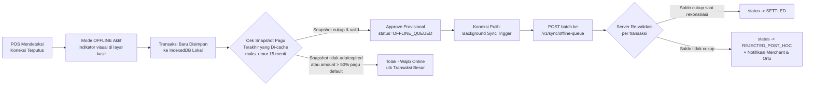

**Aturan Batasan Offline (Risk Guardrail):**
1. **Cache pagu lokal** disinkronkan setiap kasir online (bukan real-time) dan dianggap kedaluwarsa setelah **15 menit** — di luar itu, POS menolak transaksi offline demi keamanan.
2. **Batas nominal offline**: transaksi offline hanya diterima jika nilainya ≤ 50% dari `daily_limit` default sekolah (mengurangi risiko kerugian bila terjadi *overspend* saat rekonsiliasi gagal).
3. Setiap entri offline mendapat `local_tx_uuid` (client-generated) yang menjadi idempotency key saat sinkronisasi — mencegah duplikasi saat retry sync.
4. **Conflict resolution**: jika saat rekonsiliasi ternyata pagu sudah habis (karena transaksi lain masuk lebih dulu dari device lain), transaksi offline yang lebih lambat di-*timestamp* akan otomatis `REJECTED_POST_HOC` — merchant menanggung selisih ini sebagai **residual risk offline** yang dijelaskan di SOP merchant (didokumentasikan & diberi kompensasi *offline transaction insurance* dari komisi platform, opsional Fase 2).

### 8.3 Implementasi Client (Skema)

```javascript
// lib/offlineQueue.js — berjalan di Canteen Merchant POS (PWA, service worker)
import { openDB } from 'idb';

const dbPromise = openDB('valo-pos-offline', 1, {
  upgrade(db) {
    db.createObjectStore('tx_queue', { keyPath: 'local_tx_uuid' });
    db.createObjectStore('pagu_cache', { keyPath: 'student_uid_hash' });
  },
});

export async function queueOfflineTransaction(tx) {
  const db = await dbPromise;
  await db.put('tx_queue', { ...tx, sync_status: 'PENDING', created_at: Date.now() });
}

export async function syncQueueWhenOnline() {
  const db = await dbPromise;
  const pending = await db.getAll('tx_queue');
  if (pending.length === 0) return;

  const res = await fetch('/v1/sync/offline-queue', {
    method: 'POST',
    headers: { 'Content-Type': 'application/json' },
    body: JSON.stringify({ transactions: pending }),
  });
  const results = await res.json();

  for (const r of results.processed) {
    if (r.status !== 'CONFLICT') await db.delete('tx_queue', r.local_tx_uuid);
    // status CONFLICT dibiarkan tersimpan untuk audit trail lokal + notifikasi ke kasir
  }
}

// Terpicu otomatis via 'online' event browser + retry berkala (exponential backoff)
window.addEventListener('online', syncQueueWhenOnline);
```

---

## 9. SPESIFIKASI RESTFUL API

### 9.1 Skema Autentikasi

| Konsumer | Skema Auth | Keterangan |
|---|---|---|
| Parent App / School Portal / Merchant POS (client browser) | **Bearer JWT** (Supabase Auth) | JWT berisi klaim `role`, divalidasi RLS otomatis di database |
| BNI H2H SPC Gateway → VALO (webhook masuk) | **API Key + HMAC Signature** (`X-SIGNATURE`, `X-TIMESTAMP`, `X-CLIENT-KEY`) sesuai standar **SNAP BI** | Signature = `HMACSHA512(stringToSign, clientSecret)`, cek `X-TIMESTAMP` toleransi ±5 menit utk cegah replay |
| VALO → BNI H2H SPC Gateway (outbound) | **Asymmetric Signature (RSA-SHA256)** + OAuth2 Client Credentials (Access Token) | Sesuai spesifikasi SNAP BI `POST /snap/v1.0/access-token/b2b` |
| Internal Edge Function → Database | **service_role key** (bypass RLS, hanya girlang di server-side, tidak pernah dikirim ke client) | Disimpan sebagai secret di Vercel/Supabase, tidak pernah di-embed di bundle client |

### 9.2 Tabel Endpoint Utama

**Domain: Parent App**

| Method | Endpoint | Deskripsi | Auth | Success Response |
|---|---|---|---|---|
| `GET` | `/v1/parents/me/students` | List anak yang diampu | Bearer JWT (parent) | `200 { students: [...] }` |
| `PATCH` | `/v1/students/{id}/pagu` | Ubah pagu harian & kategori lock | Bearer JWT (parent) | `200 { daily_limit, updated_at }` |
| `PATCH` | `/v1/students/{id}/emergency-toggle` | Aktif/nonaktifkan Emergency Auto-Approval | Bearer JWT (parent) | `200 { emergency_approve: bool }` |
| `GET` | `/v1/students/{id}/vault` | Lihat saldo & goal Student Vault | Bearer JWT (parent) | `200 { vault_balance, savings_goal_* }` |
| `POST` | `/v1/students/{id}/vault/withdraw` | Ajukan pencairan vault (Dual Control) | Bearer JWT (parent) | `202 { withdrawal_request_id, status: 'PENDING_CONFIRM' }` |
| `POST` | `/v1/students/{id}/card/report-lost` | Lapor kartu hilang/dicuri (§12.1) | Bearer JWT (parent) | `200 { card_status: 'lost_reported' }` |
| `POST` | `/v1/ai/parent-advisor` | Query AI Parent Advisor | Bearer JWT (parent) | `200 { response, function_calls? }` |

**Domain: Canteen Merchant POS**

| Method | Endpoint | Deskripsi | Auth | Idempotent? |
|---|---|---|---|---|
| `POST` | `/v1/transactions/canteen` | Proses transaksi tap NFC (real-time) | Bearer JWT (merchant_staff) | **Wajib** `Idempotency-Key` header |
| `POST` | `/v1/sync/offline-queue` | Sinkronisasi batch transaksi offline (§8) | Bearer JWT (merchant_staff) | Ya, per `local_tx_uuid` |
| `GET` | `/v1/merchants/{id}/settlement` | Lihat status settlement H+0 | Bearer JWT (merchant_staff) | — |
| `POST` | `/v1/ai/merchant-advisor` | Query AI Sales & Inventory | Bearer JWT (merchant_staff) | — |

**Domain: School B2B Portal**

| Method | Endpoint | Deskripsi | Auth |
|---|---|---|---|
| `POST` | `/v1/schools/{id}/students` | Registrasi siswa baru + binding kartu NFC | Bearer JWT (school_admin) |
| `POST` | `/v1/schools/{id}/students/{sid}/offboard` | Proses offboarding (pindah/lulus) (§12.4) | Bearer JWT (school_admin) |
| `GET` | `/v1/schools/{id}/spp/reconciliation` | Dashboard rekonsiliasi SPP real-time | Bearer JWT (school_admin) |
| `POST` | `/v1/spp/retry` | Trigger retry manual invoice gagal | Bearer JWT (school_admin) |
| `POST` | `/v1/ai/treasury-advisor` | Query AI B2B Treasury | Bearer JWT (school_admin) |

**Domain: BNI H2H Integration (Server-to-Server)**

| Method | Endpoint | Deskripsi | Auth |
|---|---|---|---|
| `POST` | `/webhooks/bni/h2h/debit-callback` | Callback status debit SPP dari BNI | HMAC Signature (SNAP BI) |
| `POST` | `/webhooks/bni/h2h/settlement-confirm` | Konfirmasi settlement batch merchant | HMAC Signature (SNAP BI) |

### 9.3 Contoh Kontrak Detail — `POST /v1/transactions/canteen`

```
Headers:
  Authorization: Bearer <jwt>
  Idempotency-Key: 6f9c2e1a-3b7d-4e2a-9f1c-8a2d5e6f7b1c
  Content-Type: application/json

Request Body:
{
  "nfc_uid_hash": "a94a8fe5ccb19ba61c4c0873d391e987982fbbd3",
  "merchant_id": "b3e1...uuid",
  "amount": 12000,
  "items": [{ "menu": "Nasi Goreng", "qty": 1, "price": 12000 }]
}

Response 200 OK:
{
  "transaction_id": "8c1e...uuid",
  "status": "SETTLED",
  "is_emergency": false,
  "sisa_pagu": 8000,
  "settled_at": "2026-08-11T05:12:33Z"
}

Response 402 Payment Required (REJECTED_OVERLIMIT):
{
  "error": "PAGU_EXCEEDED",
  "message": "Pagu harian habis dan Emergency Auto-Approval tidak aktif / limit darurat terlampaui.",
  "sisa_pagu": 0
}

Response 423 Locked (kartu diblokir):
{ "error": "CARD_BLOCKED", "message": "Kartu telah dilaporkan hilang. Hubungi admin sekolah." }

Response 409 Conflict (idempotency key sedang diproses concurrent):
{ "error": "REQUEST_IN_PROGRESS" }
```

### 9.4 Tabel Kode Error Standar

| Kode HTTP | Error Code | Arti |
|---|---|---|
| 400 | `INVALID_PAYLOAD` | Payload tidak valid / field wajib kosong |
| 401 | `UNAUTHORIZED` | Token tidak valid/kedaluwarsa |
| 402 | `PAGU_EXCEEDED` | Pagu & emergency limit tidak mencukupi |
| 403 | `RLS_FORBIDDEN` | Akses ditolak lintas tenant |
| 404 | `STUDENT_NOT_FOUND` | UID kartu tidak terdaftar |
| 409 | `REQUEST_IN_PROGRESS` / `DUPLICATE_REQUEST` | Idempotency key sedang/sudah diproses |
| 423 | `CARD_BLOCKED` | Kartu berstatus `lost_reported`/`blocked` |
| 429 | `RATE_LIMITED` | Melebihi batas overdraft harian/mingguan |
| 503 | `H2H_GATEWAY_TIMEOUT` | BNI SPC Gateway tidak merespons dalam SLA (§12.3) |

---

## 10. ARSITEKTUR AI CHATBOT

v1.0 hanya menampilkan "contoh output" AI tanpa mendefinisikan bagaimana AI tersebut sebenarnya mengambil data. v2.0 mendefinisikan **system prompt** dan **function calling schema** konkret (kompatibel format OpenAI/Vercel AI SDK `tools`) untuk ketiga persona, sehingga output AI **selalu grounded** pada data nyata dari database — bukan halusinasi.

### 10.1 Persona A — Merchant POS AI (Sales & Inventory)

**System Prompt:**
```
Kamu adalah asisten AI untuk pemilik kantin sekolah bernama "VALO Kantin Advisor".
Tugasmu: membantu pemilik kantin memahami performa penjualan, kondisi stok, dan
memberi rekomendasi bahan baku — HANYA berdasarkan data yang dikembalikan oleh
tools yang tersedia. Jangan pernah mengarang angka omzet atau stok.
Jika data tidak tersedia, katakan dengan jujur bahwa data belum ada.
Gunakan Bahasa Indonesia santai namun profesional. Selalu akhiri dengan
satu rekomendasi actionable jika relevan.
```

**Function Calling Schema:**
```json
{
  "tools": [
    {
      "type": "function",
      "function": {
        "name": "get_daily_sales_summary",
        "description": "Mengambil ringkasan omzet dan jumlah transaksi kantin pada rentang tanggal tertentu.",
        "parameters": {
          "type": "object",
          "properties": {
            "merchant_id": { "type": "string", "format": "uuid" },
            "date_from": { "type": "string", "format": "date" },
            "date_to": { "type": "string", "format": "date" }
          },
          "required": ["merchant_id", "date_from", "date_to"]
        }
      }
    },
    {
      "type": "function",
      "function": {
        "name": "get_menu_stock_status",
        "description": "Mengambil sisa stok dan riwayat penjualan per item menu hari ini.",
        "parameters": {
          "type": "object",
          "properties": { "merchant_id": { "type": "string", "format": "uuid" } },
          "required": ["merchant_id"]
        }
      }
    },
    {
      "type": "function",
      "function": {
        "name": "get_top_selling_items",
        "description": "Mengambil daftar menu terlaris dalam N hari terakhir untuk rekomendasi restok bahan baku.",
        "parameters": {
          "type": "object",
          "properties": {
            "merchant_id": { "type": "string", "format": "uuid" },
            "last_n_days": { "type": "integer", "default": 7 }
          },
          "required": ["merchant_id"]
        }
      }
    }
  ]
}
```

### 10.2 Persona B — School B2B Treasury AI

**System Prompt:**
```
Kamu adalah "VALO Treasury Advisor", asisten AI untuk bendahara sekolah.
Fokusmu: analisis cashflow, tingkat tunggakan SPP, dan rekomendasi optimalisasi
dana mengendap di rekening Giro BNI sekolah (mis. ke produk Deposito BNI).
Selalu sebutkan sumber angka (jumlah invoice, tanggal cut-off) agar bendahara
bisa memverifikasi. JANGAN memberi saran investasi di luar produk BNI resmi.
Untuk rekomendasi penempatan dana, batasi maksimal 40% dari saldo mengendap
sebagai margin keamanan likuiditas operasional.
```

**Function Calling Schema:**
```json
{
  "tools": [
    {
      "type": "function",
      "function": {
        "name": "get_spp_collection_rate",
        "description": "Menghitung persentase SPP lunas vs tertunggak untuk periode tertentu.",
        "parameters": {
          "type": "object",
          "properties": {
            "school_id": { "type": "string", "format": "uuid" },
            "period": { "type": "string", "description": "Format YYYY-MM" }
          },
          "required": ["school_id", "period"]
        }
      }
    },
    {
      "type": "function",
      "function": {
        "name": "get_giro_balance_trend",
        "description": "Mengambil tren saldo mengendap di rekening Giro BNI sekolah 30 hari terakhir.",
        "parameters": {
          "type": "object",
          "properties": { "school_id": { "type": "string", "format": "uuid" } },
          "required": ["school_id"]
        }
      }
    },
    {
      "type": "function",
      "function": {
        "name": "simulate_deposito_allocation",
        "description": "Simulasi hasil yield jika sejumlah dana dialokasikan ke BNI Deposito jangka pendek.",
        "parameters": {
          "type": "object",
          "properties": {
            "school_id": { "type": "string", "format": "uuid" },
            "amount": { "type": "number" },
            "tenor_months": { "type": "integer", "enum": [1, 3, 6, 12] }
          },
          "required": ["school_id", "amount", "tenor_months"]
        }
      }
    }
  ]
}
```

### 10.3 Persona C — Parent App AI

**System Prompt:**
```
Kamu adalah "VALO Family Advisor", asisten AI ramah untuk orang tua murid.
Tugasmu: merekap pengeluaran jajan anak, memberi gambaran pola nutrisi
(berdasarkan kategori menu yang dibeli, BUKAN diagnosis medis), dan menyarankan
alokasi Tabungan Vault ke produk BNI Reksa Dana/wondr Growth secara opsional.
Batasan penting:
- JANGAN membuat klaim kesehatan/medis. Jika pola makan tampak tidak seimbang,
  sarankan orang tua berdiskusi dengan anak atau, bila perlu, tenaga profesional
  gizi — jangan mendiagnosis.
- Untuk rekomendasi produk investasi, selalu cantumkan bahwa ini bukan nasihat
  keuangan resmi dan hasil investasi tidak dijamin.
- Jaga nada suportif, tidak menghakimi pola belanja anak.
```

**Function Calling Schema:**
```json
{
  "tools": [
    {
      "type": "function",
      "function": {
        "name": "get_child_spending_breakdown",
        "description": "Mengambil rekap pengeluaran jajan anak per kategori menu dalam rentang waktu tertentu.",
        "parameters": {
          "type": "object",
          "properties": {
            "student_id": { "type": "string", "format": "uuid" },
            "date_from": { "type": "string", "format": "date" },
            "date_to": { "type": "string", "format": "date" }
          },
          "required": ["student_id", "date_from", "date_to"]
        }
      }
    },
    {
      "type": "function",
      "function": {
        "name": "get_vault_savings_status",
        "description": "Mengambil saldo Student Vault dan progres terhadap goal tabungan.",
        "parameters": {
          "type": "object",
          "properties": { "student_id": { "type": "string", "format": "uuid" } },
          "required": ["student_id"]
        }
      }
    },
    {
      "type": "function",
      "function": {
        "name": "simulate_reksadana_allocation",
        "description": "Simulasi proyeksi nilai jika saldo vault dialokasikan sebagian ke produk BNI Reksa Dana/wondr Growth.",
        "parameters": {
          "type": "object",
          "properties": {
            "student_id": { "type": "string", "format": "uuid" },
            "allocation_amount": { "type": "number" }
          },
          "required": ["student_id", "allocation_amount"]
        }
      }
    }
  ]
}
```

### 10.4 Guardrail Arsitektur AI (v2.0 — Baru)

- Seluruh prompt & response dicatat di tabel `ai_chat_logs` (§6.2) untuk audit kepatuhan dan evaluasi kualitas model.
- Function calling **wajib** dieksekusi lewat Edge Function yang sudah tunduk pada RLS/`profiles` scoping — AI tidak pernah diberi akses database langsung dengan `service_role`, mencegah *prompt injection* dari input pengguna mengubah scope data yang bisa diakses.
- Model direkomendasikan: **GPT-4o-mini** (sesuai v1.0) untuk latency rendah pada persona Merchant (real-time saat kasir sibuk); persona Treasury/Parent dapat memakai model yang sama karena volume query rendah dan tidak sensitif latency.

---

## 11. COMPLIANCE, RISK & SECURITY

Ini adalah bagian yang **paling absen** di v1.0 — sebuah sistem yang memproses data finansial + data pribadi anak di bawah umur tanpa kerangka kepatuhan eksplisit membawa risiko hukum serius. Berikut kerangka yang ditambahkan:

### 11.1 UU Pelindungan Data Pribadi (UU No. 27/2022) — Data Anak

Karena mayoritas siswa K-12 adalah **anak di bawah 18 tahun**, data mereka (nama, UID kartu, riwayat lokasi tap, riwayat konsumsi/nutrisi) termasuk kategori yang memerlukan perlindungan lebih ketat menurut UU PDP.

| Prinsip UU PDP | Implementasi di VALO |
|---|---|
| **Persetujuan Wali (Parental Consent)** | Akun siswa **tidak aktif** sampai orang tua/wali menyetujui `parental_consent` token saat onboarding (§4.2, tabel `parental_consent`). Consent dapat dicabut kapan saja, memicu penonaktifan kartu. |
| **Minimalisasi Data (Data Minimization)** | Sistem **tidak** menyimpan data yang tidak relevan dengan tujuan pembayaran — mis. tidak ada foto wajah anak, tidak ada data lokasi GPS granular, hanya kategori menu (bukan detail gizi medis). |
| **Purpose Limitation** | Data konsumsi kantin hanya digunakan untuk fitur budgeting & insight nutrisi kategori-umum (§10.3) — **tidak** dijual/dibagikan ke pihak ketiga (mis. produsen makanan) tanpa consent eksplisit tambahan. |
| **Hak Akses & Penghapusan (Right to Erasure)** | Orang tua dapat meminta ekspor/penghapusan data anak via School B2B Portal setelah masa retensi wajib berakhir (lihat §11.4). |
| **Data Protection Officer (DPO)** | VALO wajib menunjuk penanggung jawab pelindungan data pribadi sesuai Pasal 53 UU PDP sebelum go-live komersial. |
| **Pemberitahuan Insiden** | SOP notifikasi pelanggaran data ke Subjek Data & otoritas maksimal **3x24 jam** sejak insiden diketahui (Pasal 46). |

### 11.2 Tokenization NFC UID & Prinsip PCI-DSS / ISO 27001

v1.0 menyimpan `nfc_uid` sebagai `VARCHAR UNIQUE` polos — ini setara menyimpan nomor kartu kredit dalam bentuk plaintext.

- **Tokenization:** UID fisik kartu **tidak pernah** disimpan mentah di database. Saat kartu pertama kali dibaca (binding), sistem menghitung `nfc_uid_hash = SHA-256(raw_uid || tenant_salt)` — hanya hash inilah yang disimpan (kolom `students.nfc_uid_hash`, §6.2). `tenant_salt` unik per sekolah dan disimpan di secret manager (bukan di database yang sama).
- **UID mentah** hanya pernah ada sesaat di memori Edge Function saat proses tap — tidak pernah di-log, tidak pernah dikirim ke client selain untuk keperluan tap itu sendiri.
- **Referensi ISO 27001 (Annex A):** kontrol akses berbasis peran (A.9), kriptografi (A.10 — hashing UID, TLS 1.3 in-transit, AES-256 at-rest via Supabase default encryption), manajemen insiden (A.16).
- **Referensi prinsip PCI-DSS v4.0** (meski VALO bukan pemroses kartu kredit langsung, prinsip yang relevan tetap diadopsi sebagai best practice): *"Protect stored account data"* — diterjemahkan menjadi tokenisasi UID; *"Restrict access by business need to know"* — diterjemahkan menjadi RLS (§6.3).

### 11.3 Kepatuhan Perbankan: POJK & SNAP BI

- **POJK No. 12/POJK.03/2024** tentang Penyelenggaraan Sistem Pembayaran — VALO beroperasi sebagai *technical service provider* di bawah lisensi BNI selaku Penyelenggara Jasa Sistem Pembayaran (PJSP), bukan sebagai entitas berlisensi terpisah pada Fase 1 (model kemitraan, bukan API terbuka publik).
- **SNAP BI (Standar Nasional Open API Pembayaran)** wajib diadopsi untuk seluruh komunikasi H2H dengan BNI: format `X-SIGNATURE` (asymmetric utk access token, symmetric HMAC utk service call), `X-TIMESTAMP` ISO-8601, `X-PARTNER-ID`, serta struktur response error SNAP standar. Ini **wajib** menjadi acuan tim engineering saat implementasi §5.4 dan §9.1 — bukan format bebas.
- **Rekonsiliasi H+1**: sesuai praktik umum perbankan, VALO tetap melakukan rekonsiliasi harian H+1 terhadap seluruh instant-settlement H+0 guna mendeteksi selisih (*settlement mismatch*) sebelum ditutup buku bulanan.

### 11.4 Data Retention, Backup & Disaster Recovery *(v2.0 — Baru, tidak ada di v1.0)*

| Kebijakan | Ketentuan |
|---|---|
| **Retensi data transaksi aktif** | Selama siswa aktif + 5 tahun setelah offboarding (acuan umum retensi dokumen keuangan Indonesia) |
| **Retensi data setelah penghapusan diminta** | Data pribadi non-finansial dihapus dalam 30 hari kerja; data yang wajib disimpan untuk kepatuhan pajak/audit keuangan tetap disimpan namun di-anonimkan dari identitas langsung |
| **Backup** | Supabase Point-in-Time Recovery (PITR) aktif, retensi 7–30 hari tergantung tier; backup logis harian ke object storage terenkripsi terpisah region |
| **RTO (Recovery Time Objective)** | ≤ 4 jam untuk layanan transaksi kantin (kritikal), ≤ 24 jam untuk dashboard non-kritikal |
| **RPO (Recovery Point Objective)** | ≤ 5 menit (mengandalkan WAL streaming replication Postgres) |
| **DR Testing** | Simulasi failover minimal 1x per semester sebelum sekolah pilot berikutnya onboard |

---

## 12. EDGE CASE & ANOMALY HANDLING

Seluruh skenario berikut **tidak dibahas di v1.0** dan wajib diimplementasikan sebelum go-live, karena masing-masing berpotensi menghentikan alur transaksi inti atau menimbulkan keluhan orang tua/sekolah.

### 12.1 Kartu NFC Hilang / Dicuri / Rusak Mid-Day

| Langkah | Aksi |
|---|---|
| 1 | Orang tua melapor via `POST /v1/students/{id}/card/report-lost` (self-service, tidak perlu menunggu admin sekolah) |
| 2 | `students.card_status` → `lost_reported`; insert `card_lifecycle_events(event_type='lost_reported')` |
| 3 | Seluruh transaksi baru dengan `nfc_uid_hash` tersebut langsung ditolak `423 CARD_BLOCKED` (dicek di step awal Pagu Rules Engine, §5.5) — berlaku real-time, termasuk mid-transaction di kasir |
| 4 | Sisa pagu harian & Vault **tidak hangus** — tetap tersimpan di akun siswa, hanya kartu fisiknya yang diblokir |
| 5 | Sekolah menerbitkan kartu pengganti (H+1–H+2); `nfc_uid_hash` baru di-*rebind* ke `student_id` yang sama (UID lama tetap ter-log di `card_lifecycle_events` untuk audit, tidak dihapus) |
| 6 | **Kartu darurat sementara (opsional Fase 2):** kode QR/PIN sementara di Parent App agar anak tetap bisa jajan selagi menunggu kartu fisik, dengan limit lebih ketat (mis. maks. Rp10.000/hari) |

### 12.2 Pergantian Nomor HP Orang Tua & Token Sesi Hangus

| Langkah | Aksi |
|---|---|
| 1 | Orang tua mengajukan perubahan nomor HP via app (jika masih login) atau via Customer Service sekolah/VALO (jika sudah ter-*lockout*) |
| 2 | **Jalur self-service (masih login):** OTP dikirim ke nomor **lama** dan nomor **baru** sekaligus — keduanya harus dikonfirmasi (mencegah pengambilalihan akun oleh pihak tidak berwenang yang hanya menguasai satu nomor) |
| 3 | **Jalur CS (lockout total):** verifikasi identitas manual berlapis (KTP orang tua + data anak + riwayat transaksi terakhir) sebelum reset dilakukan oleh admin |
| 4 | Setelah nomor diperbarui: **seluruh sesi/token JWT aktif direvoke** (`auth.sessions` di-invalidate), memaksa re-login di semua device — mencegah device lama (mis. HP hilang) tetap punya akses |
| 5 | Notifikasi perubahan dikirim ke nomor lama DAN baru sebagai jejak audit yang terlihat oleh pengguna |

### 12.3 Pagu Timeout Saat Server BNI H2H Melambat

Relevan khususnya untuk **SPP auto-debit** (§5.4) dan verifikasi saldo real-time yang menyentuh sistem BNI — bukan transaksi kantin harian (yang berjalan di ledger internal VALO, hanya settlement batch yang menyentuh BNI).

| Kondisi | Respons Sistem |
|---|---|
| Response time H2H > 3 detik | **Circuit breaker** terbuka — request selanjutnya dalam 60 detik langsung fallback tanpa menunggu timeout penuh (mencegah *cascading failure*) |
| H2H down saat SPP auto-debit terjadwal | Invoice tetap dibuat berstatus `UNPAID`, retry otomatis dijadwalkan ulang setiap 30 menit hingga maksimal 4 jam sebelum eskalasi ke status `FAILED` + notifikasi bendahara |
| H2H down saat proses onboarding rekening baru | Onboarding siswa/kartu tetap bisa selesai (tidak bergantung real-time ke BNI); binding rekening BNI orang tua diberi status `PENDING_BANK_LINK` dan diselesaikan asynchronous |
| Circuit breaker recovery | Health-check probe setiap 30 detik; setelah 3 probe sukses berturut-turut, circuit breaker ditutup kembali (kembali ke mode normal) |

### 12.4 Siswa Pindah Sekolah / Lulus (Offboarding & Pencairan Vault)

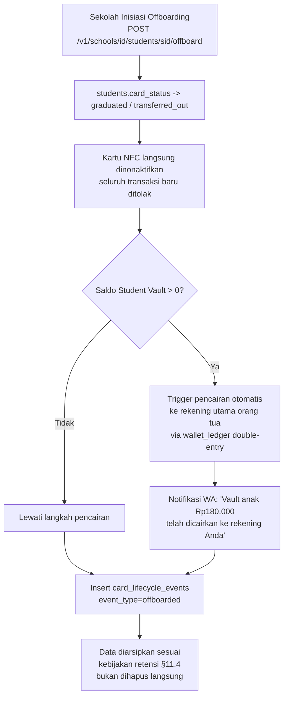

- Untuk **pindah sekolah** (bukan lulus): data `student_id` yang sama dapat di-*reattach* ke `school_id` baru jika sekolah tujuan juga menggunakan VALO (menghindari duplikasi identitas), dengan proses reset pagu & re-consent orang tua.
- Untuk **lulus**: akun diarsipkan penuh; orang tua dapat memilih membuka "Akun Alumni" pasif (read-only riwayat) atau penghapusan sesuai §11.4.

### 12.5 Anti-Fraud: Pola Emergency Overdraft Berulang

Melengkapi §2.4 — kontrol operasional harian:

- **Rate limit keras:** 1x overdraft/hari/siswa (ditegakkan di level database melalui kolom `emergency_used_today`, di-reset oleh `sp_rollover_daily_vault()`).
- **Deteksi anomali mingguan:** query terjadwal menghitung `emergency_overdraft_count_7d` per siswa; jika > 2, sistem otomatis membuat `audit_log(flag='FREQUENT_OVERDRAFT')` dan mengirim ringkasan ke orang tua agar pagu direvisi naik (mencegah anak "diam-diam" selalu dalam kondisi kekurangan pagu).
- **Deteksi anomali merchant:** jika satu merchant secara konsisten memiliki rasio transaksi `is_emergency=true` jauh di atas rata-rata merchant lain (indikasi kemungkinan kolusi menaikkan harga saat tahu siswa dalam mode darurat), di-flag untuk review manual oleh School Admin.

---

## 13. UNIT ECONOMICS & VALUE PROPOSITION

> **Catatan Metodologi (v2.0):** v1.0 menyebutkan headline figures (CAC Rp27.000, efisiensi Rp3,42 Miliar/tahun) tanpa breakdown perhitungan — sehingga angka tersebut tidak dapat diaudit atau divalidasi oleh investor/mentor teknis. Di bawah ini kami rekonstruksi **metodologi & asumsi** yang menghasilkan angka tersebut. **Ini adalah model estimasi berbasis asumsi, bukan data teraudit** — wajib divalidasi ulang dengan data pilot sekolah nyata sebelum digunakan dalam materi fundraising resmi.

### 13.1 Customer Acquisition Cost (CAC) — Breakdown

**Asumsi dasar:** 1 sekolah pilot rata-rata memiliki **500 siswa aktif** (≈ 500 akun orang tua unik), diakuisisi melalui kemitraan B2B2C (sekolah → orang tua), bukan iklan digital B2C langsung.

| Komponen Biaya per Sekolah | Nilai |
|---|---|
| Produksi kartu NFC Co-Brand (500 kartu × Rp12.000) | Rp6.000.000 |
| Operasional onboarding lapangan (tim implementasi, pelatihan admin sekolah, materi sosialisasi ke orang tua) | Rp7.500.000 |
| **Total biaya akuisisi per sekolah** | **Rp13.500.000** |
| **CAC per orang tua** (Rp13.500.000 ÷ 500) | **≈ Rp27.000** |

**Perbandingan dengan benchmark ritel (asumsi industri):** aplikasi fintech B2C konvensional umumnya mengeluarkan **Rp150.000–Rp220.000** per akun teraktivasi untuk biaya iklan digital + insentif referral (benchmark umum industri e-wallet Indonesia). Model **B2B2C via institusi** pada VALO menekan CAC hingga **~8–10x lebih efisien**, karena distribusi memanfaatkan struktur kepercayaan & kewajiban administratif yang sudah ada (siswa *harus* mendaftar via sekolah, bukan opsional seperti unduh aplikasi ritel).

### 13.2 Efisiensi Rekonsiliasi SPP — Breakdown

**Asumsi dasar:** merujuk *Pain Point* Persona 3 (Pak Budi, §4.1) — waktu rekonsiliasi manual berkurang dari **40 jam/bulan → 2 jam/bulan** (penghematan 38 jam/bulan) berkat SPP auto-debit real-time (§5.4).

| Komponen | Perhitungan |
|---|---|
| Penghematan waktu per sekolah | 38 jam/bulan × 12 bulan = **456 jam/tahun** |
| Nilai *fully-loaded* per jam kerja bendahara (gaji + overhead + nilai risiko kesalahan manual/fraud yang dihindari) | Rp150.000/jam *(asumsi konservatif-menengah, mencakup opportunity cost realokasi waktu bendahara ke aktivitas bernilai tambah lain)* |
| **Efisiensi per sekolah per tahun** | 456 jam × Rp150.000 = **Rp68.400.000** |
| **Total pada skala 50 sekolah** | Rp68.400.000 × 50 = **Rp3.420.000.000 (≈ Rp3,42 Miliar/tahun)** |

### 13.3 Value Proposition Matrix

| Stakeholder | Value Sebelum VALO | Value Setelah VALO |
|---|---|---|
| Orang Tua | Transfer manual, tidak ada kontrol jajan real-time | Kontrol pagu real-time + edukasi finansial anak (Vault) |
| Siswa | Uang tunai (rawan hilang/salah guna) | Kartu cashless, tabungan otomatis, tanpa rasa malu saat pagu habis (emergency mode) |
| Kantin | Pencairan e-wallet H+1/H+2, antre lama | Settlement H+0, kasir tanpa kembalian, AI inventory advisor |
| Sekolah | 40 jam/bulan rekonsiliasi manual | 2 jam/bulan, dana Giro teroptimasi via AI Treasury Advisor |
| BNI | Tidak ada footprint di segmen K-12 | Akuisisi rekening massal (orang tua + sekolah) sejak dini, pipeline nasabah jangka panjang |

---

## 14. TECH STACK, OBSERVABILITY & ROADMAP

### 14.1 Recommended Tech Stack (dipertahankan dari v1.0)

| Layer | Teknologi | Alasan |
|---|---|---|
| Framework Core | **Next.js 15 (App Router)** | Full-stack React framework, mendukung Edge Functions native |
| Styling & UI | **Tailwind CSS v4 + Shadcn UI** | Konsisten, responsif, cepat dikembangkan |
| Database & Realtime | **Supabase (PostgreSQL)** | RLS native (§6.3), Realtime subscription utk dashboard sekolah, pg_cron bawaan |
| AI Integration | **Vercel AI SDK + OpenAI API (GPT-4o-mini)** | Latency rendah, mendukung function calling (§10) |
| Hosting | **Vercel** | HTTPS-enabled deployment untuk PWA, Edge Function co-location |

### 14.2 Observability & Audit *(v2.0 — Baru)*

- **Structured logging:** seluruh Edge Function menulis log terstruktur (JSON) ke Vercel Log Drains / Supabase Logs, dikorelasikan dengan `idempotency_key` sebagai *trace ID* end-to-end.
- **Metrics kunci yang dipantau:** latensi `/v1/transactions/canteen` (target p95 < 800ms), tingkat `REJECTED_OVERLIMIT`, tingkat `OFFLINE_QUEUED`, tingkat kegagalan H2H (§12.3).
- **Alerting:** notifikasi otomatis ke tim engineering (mis. via Slack/PagerDuty) jika circuit breaker H2H terbuka > 5 menit, atau tingkat transaksi offline > 15% dari total transaksi harian (indikasi masalah jaringan sekolah sistemik).
- **Audit trail:** tabel `audit_log` & `ai_chat_logs` (§6.2) menjadi sumber kebenaran untuk investigasi kepatuhan (UU PDP, POJK) dan sengketa transaksi.

### 14.3 Strategi Integrasi ke wondr by BNI (Fase 2)

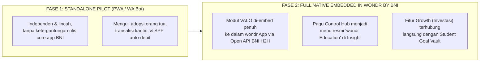

**Kriteria Go/No-Go Fase 1 → Fase 2 (v2.0 — Ditambahkan):**
- ≥ 80% orang tua aktif melakukan minimal 1 transaksi/minggu dalam 3 bulan pilot.
- Tingkat kegagalan transaksi (`REJECTED_POST_HOC` + error sistemik) < 1% dari total volume.
- Zero insiden kebocoran data yang tervalidasi selama masa pilot.
- Rekonsiliasi SPP H+1 mencapai akurasi ≥ 99,5% tanpa intervensi manual.

---

## 15. APPENDIX

### 15.1 Glosarium

| Istilah | Definisi |
|---|---|
| **H2H** | Host-to-Host — integrasi sistem langsung antar server tanpa antarmuka manusia |
| **SPC** | Sistem Pembayaran Cash (istilah internal BNI untuk gateway H2H korporat) |
| **SNAP BI** | Standar Nasional Open API Pembayaran, regulasi Bank Indonesia untuk interoperabilitas API perbankan |
| **RLS** | Row Level Security — mekanisme Postgres untuk membatasi akses baris data berdasarkan identitas sesi |
| **Idempotency Key** | Identifier unik per request agar operasi yang sama tidak diproses berulang saat retry |
| **Closed-Loop Ecosystem** | Sistem pembayaran tertutup di mana seluruh transaksi terjadi dalam satu jaringan/penerbit |
| **PWA** | Progressive Web App |

### 15.2 Referensi Regulasi & Standar

- Undang-Undang No. 27 Tahun 2022 tentang Pelindungan Data Pribadi (UU PDP)
- POJK No. 12/POJK.03/2024 tentang Penyelenggaraan Sistem Pembayaran
- Bank Indonesia — Standar Nasional Open API Pembayaran (SNAP BI)
- ISO/IEC 27001:2022 — Information Security Management
- PCI-DSS v4.0 — Payment Card Industry Data Security Standard (prinsip diadopsi sebagai best practice, bukan kewajiban langsung)
- OWASP Application Security Verification Standard (ASVS) v4.0

---

## KESIMPULAN DOKUMEN

Dokumen v2.0 ini mempertahankan seluruh visi produk dan keputusan UX yang telah divalidasi tim VALO di v1.0, sekaligus menutup 17 gap kritis yang bila dibiarkan akan menghalangi sistem ini lolos audit keamanan, kepatuhan regulasi perbankan Indonesia, maupun uji beban produksi nyata di sekolah pilot. Dokumen ini menjadi pijakan resmi bagi tim developer VALO untuk mengeksekusi koding MVP — seluruh skema database, RLS policy, API contract, diagram, dan system prompt AI **siap diimplementasikan langsung** (bukan placeholder), selaras dengan strategi kemitraan BNI Ventures dan jalur integrasi menuju wondr by BNI (Fase 2).


