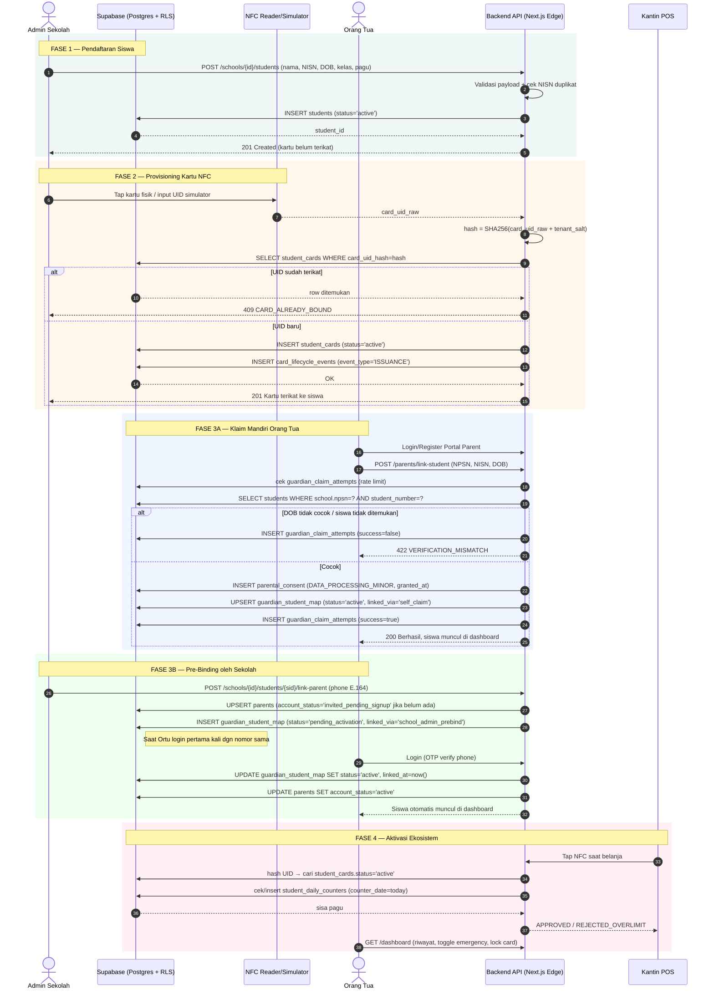
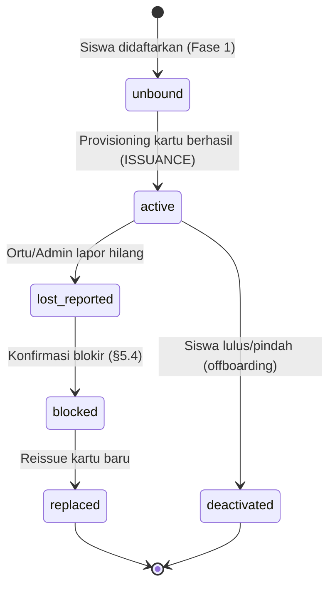
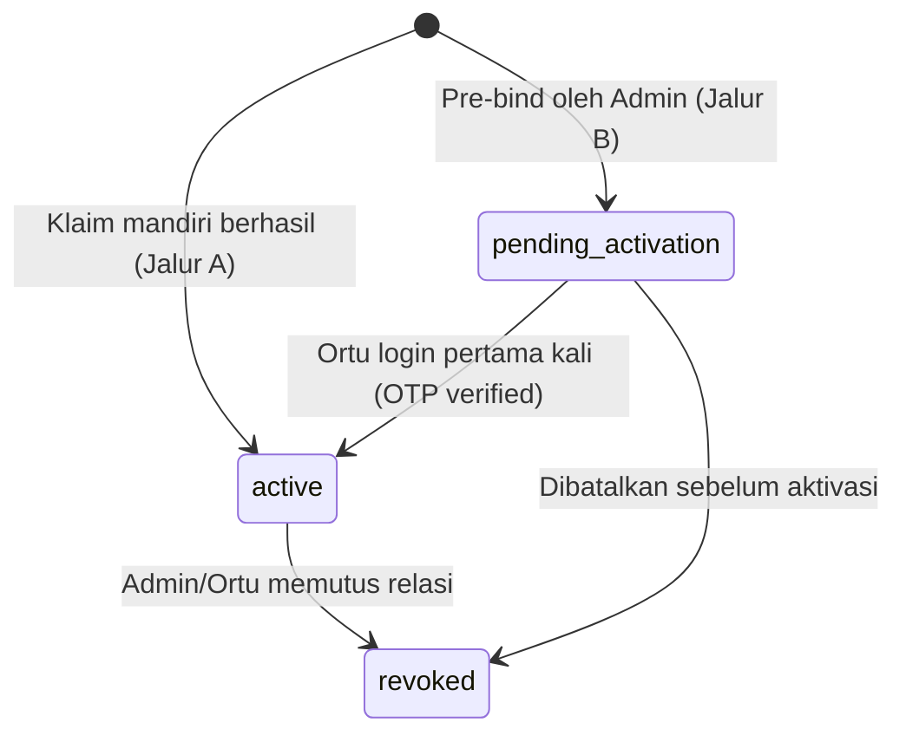

# SPESIFIKASI TEKNIS: END-TO-END LIFECYCLE FLOW
## Siswa Baru → Provisioning Kartu NFC → Penautan Orang Tua
### Addendum v2.1 terhadap `PRODUCT_SPECIFICATION_v2.md` (VALO Education Ecosystem)

| | |
|---|---|
| **Modul** | Student Onboarding, Card Provisioning & Guardian Linking |
| **Status** | Ready-for-Implementation — melengkapi §6 & §9 dokumen induk v2.0 |
| **Stack** | Next.js 15 (App Router) · Supabase (PostgreSQL 15, RLS multi-tenant) · BNI H2H SNAP BI |
| **Kepatuhan** | UU No. 27/2022 (UU PDP) — data pribadi spesifik anak (NFC UID, tanggal lahir, NISN) |

> **Catatan posisi dokumen:** Dokumen induk (§6.2) menyimpan `nfc_uid_hash` langsung pada tabel `students` dan pagu harian sebagai kolom mutable (`daily_limit_used`). Untuk mendukung *card re-issuance* (kartu hilang, banyak kartu per siswa sepanjang masa studi) dan menghindari race condition pada penghitungan pagu, addendum ini **memisahkan** kartu menjadi tabel `student_cards` dan pagu harian menjadi `student_daily_counters`. Ini adalah migrasi aditif — tidak menghapus kolom lama, lihat §1 di bawah.

---

## 1. MIGRASI SKEMA (ADDITIVE — NON-BREAKING)

```sql
-- =============================================================
-- VALO — MIGRATION v2.1: STUDENT ONBOARDING & CARD LIFECYCLE
-- =============================================================

-- 1.1 STUDENTS — lengkapi field PPDB yang belum ada di v2.0
alter table public.students
  add column if not exists student_number varchar,              -- NISN
  add column if not exists date_of_birth date,
  add column if not exists grade_level varchar,                 -- 'X', 'XI', '7', dst.
  add column if not exists class_group varchar,                 -- rombel, mis. 'IPA-2'
  add column if not exists status varchar not null default 'active'
    check (status in ('active','inactive','graduated','transferred_out'));

-- NISN unik secara nasional; unique index parsial agar NULL (belum diisi) tidak bentrok
create unique index if not exists idx_students_nisn_unique
  on public.students(student_number)
  where student_number is not null;

-- 1.2 STUDENT_CARDS — kartu dipisah dari students agar mendukung riwayat & reissue
create table public.student_cards (
  id uuid primary key default gen_random_uuid(),
  student_id uuid not null references public.students(id) on delete cascade,
  card_uid_hash varchar not null unique,        -- SHA-256(card_uid_raw + tenant_salt), never store raw UID
  card_uid_last4 varchar(4),                    -- untuk verifikasi CS non-sensitif
  status varchar not null default 'active'
    check (status in ('active','lost_reported','blocked','replaced','deactivated')),
  issued_at timestamptz not null default now(),
  deactivated_at timestamptz,
  issued_by_profile_id uuid references public.profiles(id),
  created_at timestamptz not null default now()
);

create index idx_student_cards_student on public.student_cards(student_id);

-- Invarian bisnis: maksimal 1 kartu ACTIVE per siswa pada satu waktu
create unique index idx_student_cards_one_active
  on public.student_cards(student_id)
  where status = 'active';

-- 1.3 CARD_LIFECYCLE_EVENTS — kanonikalisasi event_type (uppercase, selaras §12.1 v2.0)
alter table public.card_lifecycle_events
  drop constraint if exists card_lifecycle_events_event_type_check,
  add constraint card_lifecycle_events_event_type_check
    check (event_type in ('ISSUANCE','LOST_REPORTED','BLOCKED','REISSUED','DEACTIVATED','OFFBOARDED')),
  add column if not exists card_id uuid references public.student_cards(id);

-- 1.4 STUDENT_DAILY_COUNTERS — pagu harian dipisah dari students (hindari race condition)
create table public.student_daily_counters (
  id uuid primary key default gen_random_uuid(),
  student_id uuid not null references public.students(id) on delete cascade,
  counter_date date not null default current_date,
  daily_limit numeric(12,2) not null,
  amount_spent numeric(12,2) not null default 0,
  emergency_used boolean not null default false,
  updated_at timestamptz not null default now(),
  unique (student_id, counter_date)
);

-- 1.5 GUARDIAN_STUDENT_MAP — tambah state machine relasi
alter table public.guardian_student_map
  add column if not exists status varchar not null default 'active'
    check (status in ('pending_activation','active','revoked')),
  add column if not exists linked_via varchar not null default 'self_claim'
    check (linked_via in ('self_claim','school_admin_prebind')),
  add column if not exists linked_at timestamptz not null default now();

-- 1.6 PARENTS — dukung pre-binding sebelum orang tua pernah login
alter table public.parents
  add column if not exists account_status varchar not null default 'active'
    check (account_status in ('invited_pending_signup','active')),
  add column if not exists invited_by_school_id uuid references public.schools(id);

-- 1.7 Rate-limit klaim (mitigasi brute-force NISN+DOB — lihat §5.3)
create table public.guardian_claim_attempts (
  id uuid primary key default gen_random_uuid(),
  parent_id uuid references public.parents(id),
  ip_address inet,
  attempted_npsn varchar,
  attempted_nisn varchar,
  success boolean not null,
  created_at timestamptz not null default now()
);

create index idx_claim_attempts_parent_time on public.guardian_claim_attempts(parent_id, created_at);
```

---

## 2. SEQUENCE DIAGRAM — END-TO-END FLOW



---

## 3. STATE DIAGRAM — LIFECYCLE KARTU & RELASI WALI





---

## 4. SPESIFIKASI API ENDPOINT

### 4.1 `POST /api/v1/schools/{id}/students`
**Auth:** Bearer JWT, `role=school_admin`, `school_id` harus sama dengan `{id}` (RLS-enforced).

**Request:**
```json
{
  "full_name": "Abyan Arif Izzat Satrio",
  "student_number": "0091827364",
  "date_of_birth": "2012-05-14",
  "grade_level": "VII",
  "class_group": "7-A",
  "daily_limit": 25000
}
```

**Response `201`:**
```json
{
  "student_id": "8f2a...uuid",
  "status": "active",
  "card_bound": false,
  "guardian_linked": false
}
```

**Error 409** `STUDENT_NUMBER_EXISTS` — NISN sudah terdaftar (di sekolah manapun, karena NISN unik nasional). Sertakan `existing_school_id` agar admin bisa cek apakah ini kasus siswa pindahan yang perlu alur *transfer*, bukan pendaftaran baru.

---

### 4.2 `POST /api/v1/schools/{id}/students/{sid}/bind-card`
*(Dipisah dari endpoint pendaftaran agar mendukung tap-NFC di UI terpisah — sesuai Fase 2)*

**Request:**
```json
{
  "card_uid_raw": "04:A3:9F:12:BB:80:00",
  "device_id": "reader-lobby-01"
}
```
> `card_uid_raw` di-hash di server (`sha256(card_uid_raw + tenant_salt)`); **tidak pernah** ditulis ke storage dalam bentuk apapun, termasuk log.

**Response `201`:**
```json
{
  "card_id": "c771...uuid",
  "card_uid_last4": "BB80",
  "status": "active",
  "issued_at": "2026-08-15T03:12:00Z"
}
```

**Error 409** `CARD_ALREADY_BOUND` — hash UID sudah eksis pada `student_cards` lain (bisa aktif atau terblokir). Response menyertakan `bound_status` (bukan `student_id` demi privasi siswa lain) agar admin tahu perlu deaktivasi manual dulu.

---

### 4.3 `POST /api/v1/parents/link-student` (Jalur A — Klaim Mandiri)
**Auth:** Bearer JWT, `role=parent`.

**Request:**
```json
{
  "npsn": "20105001",
  "student_number": "0091827364",
  "date_of_birth": "2012-05-14",
  "consent_data_processing_minor": true
}
```

**Response `200`:**
```json
{
  "student_id": "8f2a...uuid",
  "guardian_relationship_status": "active",
  "consent_recorded_at": "2026-08-15T03:15:00Z"
}
```

**Error 422** `VERIFICATION_MISMATCH` — kombinasi NPSN+NISN+DOB tidak cocok. **Tidak** membedakan pesan error antara "NISN tidak ditemukan" vs "tanggal lahir salah" (mencegah *enumeration attack* NISN siswa oleh pihak tak berwenang).

**Error 429** `TOO_MANY_ATTEMPTS` — dipicu jika >5 percobaan gagal dari `parent_id`/IP yang sama dalam 15 menit (lihat `guardian_claim_attempts`, §5.3).

**Error 400** `CONSENT_REQUIRED` — `consent_data_processing_minor` harus `true` eksplisit; tidak ada default *opt-in* diam-diam (prinsip UU PDP: persetujuan tegas/*explicit consent*).

---

### 4.4 `POST /api/v1/schools/{id}/students/{sid}/link-parent` (Jalur B — Pre-Binding)
**Auth:** Bearer JWT, `role=school_admin`.

**Request:**
```json
{
  "phone_number": "081234567890",
  "relationship": "orang_tua",
  "is_primary_guardian": true
}
```
Server menormalisasi ke E.164 (`+6281234567890`) sebelum disimpan/dicocokkan.

**Response `202` (Accepted — belum aktif sampai login):**
```json
{
  "guardian_relationship_status": "pending_activation",
  "parent_account_status": "invited_pending_signup",
  "invite_channel": "whatsapp_otp"
}
```

---

### 4.5 Tabel Ringkas Error Code (tambahan §9.4 dokumen induk)

| Kode | HTTP | Endpoint | Makna | Mitigasi |
|---|---|---|---|---|
| `STUDENT_NUMBER_EXISTS` | 409 | 4.1 | NISN duplikat | Cek `existing_school_id`, arahkan ke alur transfer siswa |
| `CARD_ALREADY_BOUND` | 409 | 4.2 | UID sudah terikat siswa lain/riwayat | Deaktivasi kartu lama dulu, atau gunakan kartu fisik lain |
| `VERIFICATION_MISMATCH` | 422 | 4.3 | NPSN/NISN/DOB tidak cocok | Pesan generik, tidak bocorkan field mana yang salah |
| `TOO_MANY_ATTEMPTS` | 429 | 4.3 | Rate limit klaim | Cooldown 15 menit, eskalasi ke `audit_log` jika berulang |
| `CONSENT_REQUIRED` | 400 | 4.3 | Consent flag tidak `true` | Blokir klaim sampai consent eksplisit diberikan |
| `GUARDIAN_ALREADY_LINKED` | 409 | 4.4 | Nomor HP sudah terhubung ke siswa ini | No-op idempotent, kembalikan status existing |

---

## 5. STATUS MATRIX — MUTASI TABEL PER FASE

### Fase 1 — Setelah `INSERT students`
```json
// public.students
{
  "id": "8f2a...",
  "full_name": "Abyan Arif Izzat Satrio",
  "student_number": "0091827364",
  "date_of_birth": "2012-05-14",
  "grade_level": "VII",
  "class_group": "7-A",
  "status": "active",
  "daily_limit_used": 0
}
// public.student_cards -> (kosong, belum ada baris)
// public.guardian_student_map -> (kosong, belum ada baris)
```

### Fase 2 — Setelah Binding Kartu
```json
// public.student_cards (baris baru)
{
  "id": "c771...",
  "student_id": "8f2a...",
  "card_uid_hash": "b3f2c9...(sha256)",
  "card_uid_last4": "BB80",
  "status": "active",
  "issued_at": "2026-08-15T03:12:00Z"
}
// public.card_lifecycle_events (baris baru)
{
  "id": "e001...",
  "student_id": "8f2a...",
  "card_id": "c771...",
  "event_type": "ISSUANCE",
  "actor_profile_id": "admin-profile-uuid"
}
```

### Fase 3A — Setelah Klaim Mandiri
```json
// public.parents (contoh existing/baru)
{
  "id": "p551...",
  "auth_user_id": "auth-uuid",
  "phone_number": "+6281234567890",
  "account_status": "active"
}
// public.parental_consent (baris baru)
{
  "id": "pc001...",
  "parent_id": "p551...",
  "student_id": "8f2a...",
  "consent_type": "DATA_PROCESSING_MINOR",
  "consent_token": "signed-jwt-or-uuid",
  "granted_at": "2026-08-15T03:15:00Z"
}
// public.guardian_student_map (baris baru)
{
  "id": "g100...",
  "parent_id": "p551...",
  "student_id": "8f2a...",
  "status": "active",
  "is_primary_guardian": true,
  "linked_via": "self_claim",
  "linked_at": "2026-08-15T03:15:00Z"
}
```

### Fase 3B — Setelah Pre-Binding (sebelum Ortu login)
```json
// public.parents (dibuat "invited" oleh admin)
{
  "id": "p552...",
  "auth_user_id": null,
  "phone_number": "+6281234567890",
  "account_status": "invited_pending_signup"
}
// public.guardian_student_map (status masih pending)
{
  "id": "g101...",
  "parent_id": "p552...",
  "student_id": "8f2a...",
  "status": "pending_activation",
  "linked_via": "school_admin_prebind"
}
```
**Trigger aktivasi:** saat `auth.users` baru login dengan nomor telepon yang cocok, backend menjalankan `UPDATE parents SET auth_user_id=..., account_status='active'` dan `UPDATE guardian_student_map SET status='active', linked_at=now() WHERE parent_id=...`.

---

## 6. EDGE CASE & VALIDASI KHUSUS

### 6.1 Kartu UID Duplikat
- **Deteksi:** unique constraint pada `student_cards.card_uid_hash` — collision hash SHA-256 secara praktis nihil, jadi duplikat berarti UID fisik memang sama (kartu di-tap ulang, atau kartu bekas siswa lama belum dideaktivasi).
- **Response:** `409 CARD_ALREADY_BOUND`. Jika kartu lama berstatus `deactivated`/`blocked`, sistem menawarkan opsi *"kartu ini pernah dipakai siswa lain — lanjutkan re-binding?"* agar admin bisa daur ulang kartu fisik secara sengaja (bukan default otomatis).
- **Audit:** setiap percobaan binding gagal dicatat ke `audit_log` dengan `entity_type='student_cards'`.

### 6.2 NISN Ganda
- **Deteksi:** `idx_students_nisn_unique` (partial unique index, NISN unik nasional lintas sekolah dalam satu instance VALO).
- **Kasus wajar:** siswa pindah sekolah antar tenant VALO — bukan bug, tapi butuh alur *transfer* eksplisit, bukan insert baru.
- **Response:** `409 STUDENT_NUMBER_EXISTS` menyertakan `existing_school_id` (tanpa data pribadi lain) agar admin sekolah asal dan tujuan bisa berkoordinasi via SOP offboarding (§12.4 dokumen induk) sebelum re-registrasi di sekolah baru.

### 6.3 Tanggal Lahir Tidak Cocok Saat Klaim
- **Risiko keamanan:** endpoint klaim (`/parents/link-student`) adalah satu-satunya jalur di mana pihak eksternal bisa "menebak" kombinasi NISN+DOB anak — ini permukaan serangan *enumeration* terhadap data pribadi anak.
- **Mitigasi berlapis:**
  1. Pesan error **generik** (`VERIFICATION_MISMATCH`) — tidak membedakan "NISN tidak ada" vs "DOB salah".
  2. **Rate limiting** via `guardian_claim_attempts`: maksimal 5 percobaan/15 menit per akun & per IP; lampaui batas → `429 TOO_MANY_ATTEMPTS`.
  3. Percobaan gagal berulang (>10x/hari dari IP yang sama, lintas akun) memicu flag `SUSPICIOUS_CLAIM_PATTERN` ke `audit_log` untuk investigasi manual.
  4. Setelah klaim berhasil, `guardian_student_map.is_primary_guardian` kedua/ketiga (wali tambahan) tetap memerlukan approval dari wali utama yang sudah aktif — mencegah pihak tak dikenal menambahkan dirinya sebagai wali baru tanpa sepengetahuan wali pertama *(kebijakan produk, dikonfirmasi dengan tim; default: notifikasi ke wali utama, bukan blokir keras)*.

### 6.4 Kartu Hilang → Card Re-Issuance
1. Ortu/Admin memicu **lapor hilang**: `UPDATE student_cards SET status='lost_reported' WHERE id=...` + `INSERT card_lifecycle_events (event_type='LOST_REPORTED')`. Efek langsung: kartu **ditolak** di semua tap POS (dicek via `student_cards.status='active'` sebagai syarat approval).
2. Setelah konfirmasi (grace period, mis. 1x24 jam untuk kasus "ketinggalan di rumah"), status dinaikkan ke `blocked` bila memang hilang permanen.
3. **Reissue:** admin melakukan tap kartu fisik baru → endpoint 4.2 dipanggil ulang. Karena unique partial index `idx_student_cards_one_active` mensyaratkan hanya 1 kartu `active` per siswa, backend **wajib** men-set kartu lama ke `replaced` dalam transaksi yang sama sebelum insert kartu baru:
   ```sql
   begin;
     update public.student_cards
       set status = 'replaced', deactivated_at = now()
       where id = :old_card_id and status in ('lost_reported','blocked');
     insert into public.student_cards (student_id, card_uid_hash, card_uid_last4, status)
       values (:student_id, :new_hash, :new_last4, 'active');
     insert into public.card_lifecycle_events (student_id, card_id, event_type, notes)
       values (:student_id, :new_card_id, 'REISSUED', 'Pengganti kartu ' || :old_card_id);
   commit;
   ```
4. **Kontinuitas data:** `student_daily_counters` dan `guardian_student_map` **tidak terpengaruh** karena keduanya di-key oleh `student_id`, bukan `card_id` — saldo pagu, riwayat jajan, dan relasi wali tetap utuh setelah reissue.

---

## 7. RINGKASAN KETERKAITAN DENGAN DOKUMEN INDUK v2.0

| Bagian addendum ini | Melengkapi bagian di v2.0 |
|---|---|
| §1 Migrasi skema | §6.2 (DDL) — memisahkan kartu & pagu harian dari `students` |
| §2–3 Diagram | §5 (System Diagrams) — menambah alur onboarding yang belum ada |
| §4 API | §9.2 (Tabel Endpoint) — 4 endpoint baru untuk lifecycle onboarding |
| §6.3 Rate limiting klaim | §11.1 (UU PDP) & §12.5 (Anti-Fraud) — pola mitigasi yang sama diterapkan ke permukaan serangan baru |
| §6.4 Reissue kartu | §12.1 (Kartu Hilang) — detail implementasi transaksional yang sebelumnya berupa SOP naratif |
